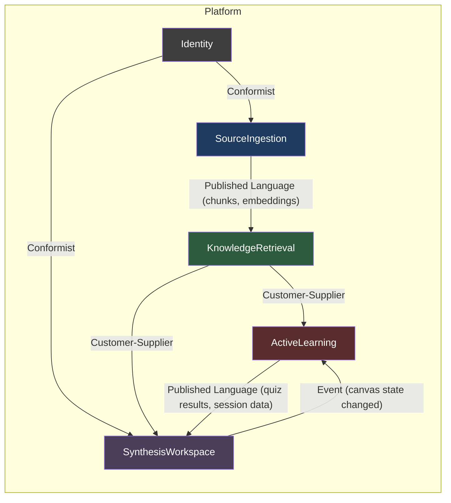

# Phase 0 — Master Implementation Brief

> **Historical v1 document.** This file describes the superseded v1 `Synthesis Studio` direction and is retained as a historical record. For the current product direction, use the v2 docs stack starting with [v2-master-brief.md](./v2-master-brief.md).

> **Codename:** Synthesis Studio
> **Version:** 0.1.0
> **Date:** 2026-04-07
> **Status:** Draft — awaiting founder approval
> **Primary Source:** [AI Education Platform Analysis](/AI_Education_Platform_Analysis.md)

---

## 1. Executive System Overview

### What the Platform Is

Synthesis Studio is an AI-powered educational workspace that transforms uploaded study materials (PDFs, slides, text) into structured active-learning experiences. Instead of a chatbot that answers questions, the default experience is a **Synthesis Canvas** — an interactive concept-map environment where students build understanding by filling in missing relationships, answering Socratic prompts, and completing retrieval quizzes, all grounded in exact citations from their own source documents.

### What Makes It Different

| Dimension | NotebookLM / ChatGPT | Synthesis Studio |
|---|---|---|
| **Default UX** | Open-ended chat | Structured Synthesis Canvas |
| **AI role** | Answer machine | Socratic guide that withholds answers |
| **Citation model** | Approximate references | Exact chunk-level citations (page, paragraph) |
| **Learning model** | Passive consumption | Active retrieval, elaboration, gap detection |
| **Output ownership** | AI-generated summaries | Student-constructed knowledge artifacts |

### What the MVP Is Trying to Prove

Three hypotheses, in priority order:

1. **Desirable difficulty converts:** Students will choose a tool that makes them work harder *if* the interface makes the active path more rewarding than passive chat.
2. **Source-grounded outputs are trusted:** Exact citations create a qualitatively different trust level compared to LLM-only answers.
3. **Active learning is demoable:** A single-user, single-notebook vertical slice is compelling enough to attract early adopters in the Danish Gymnasium exam season.

### Deployment Target

Google Cloud: Firebase (Auth, Firestore, Cloud Storage) + Cloud Run (FastAPI backend). EU region (`europe-north1` Finland or `europe-west1` Belgium).

---

## 2. Product Thesis

### The Core Learning Loop

```
Upload Sources → AI generates Skeleton Concept Map →
Student fills gaps using source evidence → Socratic Tutor probes understanding →
Quiz confirms retention → Gap Hunter reveals weak areas → Student re-engages sources
```

This is a **closed loop**, not a linear funnel. Every output feeds back into the next input. The student never "finishes" — they deepen.

### Why This Product Should Exist

Current AI tools optimize for convenience. They give students answers. The pedagogical research is clear: retrieval practice, elaboration, and self-explanation produce durable learning (report §4.1–4.3). No current product makes these cognitive strategies the *default* interaction pattern. NotebookLM comes closest but still defaults to chat. Alice.tech focuses on exam prep but uses a Duolingo-style quiz loop, not source-grounded synthesis.

The gap is a tool that treats the student's *own* study materials as the ground truth and forces active engagement with that material rather than generating new content from model knowledge.

### What Behavior It Should Encourage

- Uploading real course materials (not generic topics)
- Spending time constructing explanations in the canvas
- Returning to sources when the tutor challenges an assertion
- Reviewing quiz results to identify weak areas
- Iterating on concept maps over multiple study sessions

### What Behavior It Should Discourage

- Asking open-ended questions and expecting direct answers
- Copying AI-generated summaries without engagement
- Using the platform as a search engine or chatbot
- Expecting the AI to produce essays, homework solutions, or exam answers
- Passive reading of AI-generated concept maps (the "illusion of competence" — report §3.3)

---

## 3. Strict MVP Scope

### In Scope (Non-Negotiable for Demo)

| # | Feature | Description | Why Non-Negotiable |
|---|---|---|---|
| 1 | **Source Upload** | Upload PDF/PPTX/DOCX. Parse, chunk, embed, store. | Without sources, nothing works. |
| 2 | **Exact Citations** | Every AI output links to specific chunk(s) with page/paragraph reference. | Core trust differentiator. |
| 3 | **Synthesis Canvas** | Interactive concept-map workspace. AI generates skeleton; student fills gaps. | The "aha moment" — this IS the product. |
| 4 | **Socratic Tutor** | Side-panel that asks probing questions. Gives hints, not answers. Source-grounded. | Demonstrates pedagogical restraint. |
| 5 | **Quiz / Flashcards** | Auto-generated from sources. MCQ + open-ended. Shows source citations on review. | Demonstrates retrieval practice loop. |
| 6 | **Gap Hunter** | Analyzes canvas + quiz results to identify topics with low coverage or poor performance. | Closes the learning loop. |

### Out of Scope (Will NOT Be Built in V1)

| Feature | Rationale |
|---|---|
| Multi-user collaboration / real-time editing | Individual cognitive loop first. Collaboration is a Phase 3+ feature. |
| Teacher dashboard / analytics | B2C-first strategy. Teacher features come in Phase 2 GTM. |
| Audio/video source support | Adds parsing complexity without changing the core learning loop. |
| Mobile native app | Responsive web is sufficient for demo. |
| Admin dashboard | No institutional customers in v1. |
| Payment/subscription system | Manual onboarding for early testers. Stripe integration is a v2 task. |
| Public sharing / publishing | Single-user product. |
| Web scraping as a source type | PDF/PPTX/DOCX covers 95% of student material. |
| Custom model fine-tuning | Proprietary APIs are the v1 strategy. |
| Offline mode | Cloud-first product. |
| Plugin/extension system | Premature abstraction. |
| SSO beyond Firebase Auth | UNI-Login is a Phase 3 institutional requirement. |
| Roleplay / scenario simulations | Report §8.2 explicitly postpones this. Harder to ground across subjects. |
| Image generation / dual coding visuals | Report §8.2 postpones. Focus on text + diagrams. |
| Spaced repetition scheduling | Quiz *generation* is in scope. Scheduling algorithm is v2 polish. |

### Postponed to V2

| Feature | When | Dependency |
|---|---|---|
| Spaced repetition (SM-2 or FSRS) | After quiz data validates the learning loop | Sufficient quiz interaction data |
| Teacher-curated source locks | Phase 2 GTM when teachers adopt | Teacher account type |
| UNI-Login / SAML SSO | Phase 3 institutional pilots | Denmark-specific OIDC integration |
| Danish Foundation Models (DFM) embeddings | When DK-language grounding quality is validated | Benchmark against proprietary embeddings |
| Multi-language UI | After Danish and English are stable | i18n infrastructure |

### Anti-Feature-Creep Notes

> **Rule:** If a proposed feature does not directly serve the core learning loop (Upload → Canvas → Tutor → Quiz → Gap → Re-engage), it is out of scope. No exceptions.

- Do NOT add a "general chat" mode. Every AI interaction must have a structured purpose.
- Do NOT build "smart suggestions" or "AI recommendations" that are not grounded in uploaded sources.
- Do NOT build analytics dashboards. A simple "Gap Hunter" result page is sufficient.
- Do NOT attempt to support every document format. PDF, PPTX, and DOCX only.
- Do NOT build notification systems, email integrations, or social features.

---

## 4. Bounded Contexts

### Context Map



### Context Definitions

#### SourceIngestion

| Field | Value |
|---|---|
| **Responsibility** | Accept document uploads, parse content with structure preservation, chunk semantically, generate embeddings, store in vector store. |
| **Owns** | `Source`, `Chunk`, `ProcessingJob` |
| **Exposes** | `POST /sources`, `GET /sources`, `GET /sources/:id`, `DELETE /sources/:id`, Event: `source.processed` |
| **Depends On** | Identity (for userId), LLM Provider (for embeddings) |

#### KnowledgeRetrieval

| Field | Value |
|---|---|
| **Responsibility** | Semantic search over chunks, citation resolution, context assembly for downstream AI calls. |
| **Owns** | `Citation`, vector index |
| **Exposes** | `POST /search` (semantic search), `GET /citations/:id`, internal: `retrieve_context(query, sourceIds)` |
| **Depends On** | SourceIngestion (reads chunks and embeddings) |

#### ActiveLearning

| Field | Value |
|---|---|
| **Responsibility** | Socratic tutoring sessions, quiz/flashcard generation, gap analysis. All AI interactions with pedagogical restraint. |
| **Owns** | `TutorSession`, `TutorMessage`, `QuizItem`, `QuizAttempt`, `KnowledgeGap` |
| **Exposes** | `POST /tutor/sessions`, `POST /tutor/sessions/:id/messages`, `POST /quizzes/generate`, `POST /quizzes/:id/submit`, `POST /gaps/analyze` |
| **Depends On** | KnowledgeRetrieval (for source-grounded context), Identity |

#### SynthesisWorkspace

| Field | Value |
|---|---|
| **Responsibility** | Canvas state management. CRUD for synthesis nodes, edges, and annotations. Notebook-level organization. |
| **Owns** | `Notebook`, `SynthesisNode`, `SynthesisEdge` |
| **Exposes** | `POST /notebooks`, `GET /notebooks/:id`, `PUT /notebooks/:id/nodes`, `PUT /notebooks/:id/edges`, `DELETE /notebooks/:id` |
| **Depends On** | KnowledgeRetrieval (for linking nodes to citations), Identity |

#### Identity

| Field | Value |
|---|---|
| **Responsibility** | Authentication, user profile, usage tracking. Thin layer delegating to Firebase Auth. |
| **Owns** | `UserProfile` |
| **Exposes** | Firebase Auth SDK (frontend), `GET /users/me`, `PUT /users/me` |
| **Depends On** | Firebase Auth (external) |

### Integration Patterns

- **SourceIngestion → KnowledgeRetrieval:** Published Language. Chunks and embeddings are written to shared storage (Firestore + vector store). KnowledgeRetrieval reads them. No runtime coupling.
- **KnowledgeRetrieval → ActiveLearning / SynthesisWorkspace:** Customer-Supplier. Active Learning and Synthesis Workspace call KnowledgeRetrieval's search endpoint to get grounded context. KR defines the contract.
- **ActiveLearning ↔ SynthesisWorkspace:** Shared Kernel via events. When quiz results or gap analysis completes, events update the canvas. When canvas state changes significantly, it can trigger gap re-analysis.
- **Identity → All:** Conformist. All contexts accept the userId from Firebase Auth tokens without owning auth logic.

---

## 5. Architecture Decisions

### ADR-1: LLM Provider Abstraction

**Status:** Accepted
**Context:** The MVP must ship fast using proprietary APIs, but the report (§6.2) mandates a migration path to open-source/self-hosted models for EU compliance. Hard-coding a single provider would create lock-in.
**Decision:** Define a `LLMProvider` protocol (Python abstract class) with methods: `generate(prompt, context, config) → LLMResponse`, `embed(texts) → list[list[float]]`, `stream_generate(prompt, context, config) → AsyncIterator[str]`. Ship with `GoogleVertexProvider` and `OpenAIProvider` implementations. All prompt templates live in a `prompts/` directory, not in provider code.
**Consequences:** Slight over-engineering for v1. Accepted because the abstraction is thin (< 100 LOC per provider) and prevents a costly refactor when institutional customers demand sovereign models.

### ADR-2: Document Chunking — Semantic-First Hybrid

**Status:** Accepted
**Context:** Fixed-size chunking loses document structure (headers, sections). Pure semantic chunking is expensive and unpredictable. The report (§6.1) recommends "Pedagogical Chunking" following document logical structure.
**Decision:** Use a two-pass approach: (1) structure-aware parsing via `unstructured` library to extract sections, headers, and paragraphs; (2) split large sections into sub-chunks with ~500 token target size using sentence boundaries. Preserve hierarchy metadata (chapter → section → paragraph) on each chunk.
**Consequences:** Parsing quality depends on PDF structure. Poorly formatted PDFs will produce lower-quality chunks. Acceptable for v1 — most student materials (slides, textbooks) have clear structure.

### ADR-3: Citation Linking — Chunk-ID-Based

**Status:** Accepted
**Context:** Every AI output must link to exact source locations. Approximate citations destroy trust.
**Decision:** Every LLM call that generates user-facing content receives a set of `Chunk` objects as context. The prompt instructs the model to return `chunk_ids` alongside each claim. The backend validates that returned chunk_ids exist in the user's sources. Citations are stored as `Citation` objects linking `(outputId, chunkId, relevanceScore)`. The frontend renders citations as clickable references that highlight the source passage.
**Consequences:** Relies on the LLM following citation instructions reliably. Gemini and Claude handle this well with structured output. Occasionally the model may hallucinate a chunk_id — backend validation catches this and strips invalid citations rather than failing.

### ADR-4: Sync vs. Async Processing Boundary

**Status:** Accepted
**Context:** Some operations (source parsing, embedding generation, quiz generation, gap analysis) take 10–60 seconds. Blocking HTTP requests for these durations is unacceptable.
**Decision:**
- **Synchronous:** Auth, source listing, chunk search, canvas CRUD, tutor message (streaming), citation retrieval.
- **Asynchronous (job-based):** Source upload processing (parse → chunk → embed), quiz batch generation, gap analysis. These return a `jobId` immediately. Frontend polls `GET /jobs/:id` for status. Cloud Tasks triggers the actual processing.
**Consequences:** Adds a job management layer. Acceptable complexity — Cloud Tasks handles retry and dead-letter. Frontend needs a simple polling/websocket pattern for job status.

### ADR-5: Firestore Document Structure — Notebook-Centric

**Status:** Accepted
**Context:** The data model must balance read performance (canvas rendering, quiz display) with write patterns (node updates, quiz submissions). Firestore's strengths are document reads and shallow queries; its weaknesses are cross-collection queries and transactions.
**Decision:** Top-level collections: `users`, `notebooks`, `sources`, `jobs`. Subcollections under `notebooks`: `nodes`, `edges`, `tutorSessions`, `quizItems`, `gaps`. Subcollections under `sources`: `chunks`. Citations are stored as a subcollection under `notebooks` linking to chunk references. This groups data by notebook for fast canvas loads while keeping sources independently queryable.
**Consequences:** Denormalization of source titles into citation objects. Cross-notebook search requires querying multiple subcollections. Acceptable for single-user v1 — no cross-user queries needed.

### ADR-6: Frontend Data Fetching — Hybrid RSC + Client

**Status:** Accepted
**Context:** Next.js App Router supports React Server Components (RSC) for initial data loading and client components for interactivity. The Synthesis Canvas is highly interactive; source listing is mostly static.
**Decision:** Use RSC for: source listing pages, notebook listing, quiz results (read-heavy). Use client components with `useSWR` for: canvas (real-time node manipulation), tutor chat (streaming), quiz interaction (user input). API calls from RSC go through Next.js route handlers that proxy to FastAPI. Client components call FastAPI directly via the public API with Firebase Auth tokens.
**Consequences:** Two data-fetching patterns in the same app. Manageable with clear conventions: RSC for read-only pages, client for interactive views. No server-side sessions needed.

### ADR-7: Vector Store — Firestore + In-Memory for V1

**Status:** Accepted
**Context:** A production vector store (Qdrant, Pinecone) adds infrastructure complexity. For a demo with <100 sources per user, the vector search requirements are modest.
**Decision:** For v1 demo: store embeddings as float arrays in Firestore `chunks` documents. Perform vector search in the FastAPI backend by loading relevant chunks into memory and using numpy cosine similarity. For v2: migrate to Vertex AI Vector Search or Qdrant when scale requires it.
**Consequences:** Search latency increases with chunk count. Acceptable for demo (expected <5,000 chunks per user). The `LLMProvider.embed()` abstraction means the storage backend can change independently of the embedding model.

### ADR-8: Auth — Firebase Auth with Custom Claims

**Status:** Accepted
**Context:** The platform needs authentication but no institutional SSO in v1. Firebase Auth is free, supports email/password and Google Sign-In, and integrates natively with Firestore security rules.
**Decision:** Use Firebase Auth for all authentication. Store minimal user profile in Firestore `users` collection (display name, created date, preferences). Backend validates Firebase ID tokens on every request via `firebase-admin` SDK. No custom session management. Architecture is "UNI-Login ready" — the auth middleware accepts any OIDC token, making future SSO integration a configuration change.
**Consequences:** Tightly coupled to Firebase for auth. Acceptable for v1. The abstraction cost of building a custom auth layer is not justified until institutional pilots in Phase 3.

---

## 6. Data Model Proposal

### Firestore Collection Hierarchy

```
firestore/
├── users/{userId}
│   ├── displayName: string
│   ├── email: string
│   ├── createdAt: timestamp
│   ├── preferences: { language: "da" | "en" }
│   └── usage: { sourcesUploaded: number, quizzesTaken: number }
│
├── notebooks/{notebookId}
│   ├── userId: string
│   ├── title: string
│   ├── description: string
│   ├── sourceIds: string[]
│   ├── createdAt: timestamp
│   ├── updatedAt: timestamp
│   ├── status: "active" | "archived"
│   │
│   ├── /nodes/{nodeId}                    # SynthesisNode
│   ├── /edges/{edgeId}                    # SynthesisEdge
│   ├── /tutorSessions/{sessionId}         # TutorSession
│   │   └── /messages/{messageId}          # TutorMessage
│   ├── /quizItems/{quizItemId}            # QuizItem
│   ├── /quizAttempts/{attemptId}          # QuizAttempt
│   ├── /gaps/{gapId}                      # KnowledgeGap
│   └── /citations/{citationId}            # Citation
│
├── sources/{sourceId}
│   ├── userId: string
│   ├── notebookId: string
│   ├── title: string
│   ├── fileName: string
│   ├── fileType: "pdf" | "pptx" | "docx" | "txt"
│   ├── storagePath: string
│   ├── status: "uploading" | "processing" | "ready" | "error"
│   ├── chunkCount: number
│   ├── createdAt: timestamp
│   ├── processedAt: timestamp | null
│   ├── errorMessage: string | null
│   │
│   └── /chunks/{chunkId}                  # Chunk
│
└── jobs/{jobId}
    ├── userId: string
    ├── type: "source_processing" | "quiz_generation" | "gap_analysis"
    ├── status: "pending" | "running" | "completed" | "failed"
    ├── targetId: string
    ├── progress: number (0-100)
    ├── result: object | null
    ├── error: string | null
    ├── createdAt: timestamp
    └── completedAt: timestamp | null
```

### Core TypeScript Interfaces

```typescript
// === Source Ingestion Context ===

interface Source {
  id: string;
  userId: string;
  notebookId: string;
  title: string;
  fileName: string;
  fileType: "pdf" | "pptx" | "docx" | "txt";
  storagePath: string;           // Cloud Storage path
  status: "uploading" | "processing" | "ready" | "error";
  chunkCount: number;
  createdAt: Date;
  processedAt: Date | null;
  errorMessage: string | null;
}

interface Chunk {
  id: string;
  sourceId: string;
  userId: string;
  content: string;              // raw text content
  tokenCount: number;
  embedding: number[];          // float32 array, 768 or 1536 dims
  position: ChunkPosition;
  metadata: ChunkMetadata;
  createdAt: Date;
}

interface ChunkPosition {
  pageStart: number;
  pageEnd: number;
  sectionTitle: string | null;
  chapterTitle: string | null;
  paragraphIndex: number;
  charStart: number;
  charEnd: number;
}

interface ChunkMetadata {
  language: "da" | "en" | "unknown";
  hasTable: boolean;
  hasImage: boolean;
  hierarchyPath: string[];      // ["Chapter 3", "Section 3.2", "Paragraph 1"]
}

// === Knowledge Retrieval Context ===

interface Citation {
  id: string;
  notebookId: string;
  outputType: "tutor_message" | "quiz_item" | "canvas_node" | "gap_result";
  outputId: string;
  chunkId: string;
  sourceId: string;
  sourceTitle: string;          // denormalized for display
  pageStart: number;            // denormalized from chunk
  pageEnd: number;
  sectionTitle: string | null;
  relevanceScore: number;       // 0.0-1.0
  createdAt: Date;
}

// === Synthesis Workspace Context ===

interface Notebook {
  id: string;
  userId: string;
  title: string;
  description: string;
  sourceIds: string[];
  createdAt: Date;
  updatedAt: Date;
  status: "active" | "archived";
}

interface SynthesisNode {
  id: string;
  notebookId: string;
  type: "concept" | "question" | "evidence" | "summary" | "gap_marker";
  label: string;
  content: string;
  status: "skeleton" | "student_filled" | "ai_generated" | "verified";
  positionX: number;
  positionY: number;
  citationIds: string[];
  createdBy: "ai" | "student";
  createdAt: Date;
  updatedAt: Date;
}

interface SynthesisEdge {
  id: string;
  notebookId: string;
  sourceNodeId: string;
  targetNodeId: string;
  label: string;                // relationship description
  status: "skeleton" | "student_labeled" | "ai_generated";
  createdBy: "ai" | "student";
  createdAt: Date;
}

// === Active Learning Context ===

interface TutorSession {
  id: string;
  notebookId: string;
  userId: string;
  focusArea: string;            // topic or chunk reference
  sourceIds: string[];          // which sources are in scope
  status: "active" | "paused" | "completed";
  messageCount: number;
  createdAt: Date;
  updatedAt: Date;
}

interface TutorMessage {
  id: string;
  sessionId: string;
  role: "tutor" | "student";
  content: string;
  messageType: "question" | "hint" | "challenge" | "affirmation" | "redirect" | "student_response";
  citationIds: string[];
  createdAt: Date;
}

interface QuizItem {
  id: string;
  notebookId: string;
  sourceIds: string[];
  questionType: "mcq" | "open_ended" | "true_false";
  question: string;
  options: string[] | null;     // for MCQ
  correctAnswer: string;
  explanation: string;
  citationIds: string[];
  difficulty: "recall" | "understanding" | "application";
  bloomLevel: number;           // 1-6
  createdAt: Date;
}

interface QuizAttempt {
  id: string;
  notebookId: string;
  userId: string;
  quizItemId: string;
  userAnswer: string;
  isCorrect: boolean;
  timeTakenMs: number;
  attemptNumber: number;
  createdAt: Date;
}

interface KnowledgeGap {
  id: string;
  notebookId: string;
  userId: string;
  topic: string;
  description: string;
  confidence: number;           // 0.0-1.0, how confident we are this is a gap
  evidence: GapEvidence[];
  sourceIds: string[];          // sources that cover this topic
  status: "identified" | "acknowledged" | "addressed";
  createdAt: Date;
  updatedAt: Date;
}

interface GapEvidence {
  type: "quiz_failure" | "canvas_empty" | "tutor_struggle" | "low_coverage";
  referenceId: string;
  detail: string;
}

// === Jobs ===

interface ProcessingJob {
  id: string;
  userId: string;
  type: "source_processing" | "quiz_generation" | "gap_analysis";
  status: "pending" | "running" | "completed" | "failed";
  targetId: string;
  progress: number;
  result: Record<string, unknown> | null;
  error: string | null;
  createdAt: Date;
  completedAt: Date | null;
}
```

---

## 7. API Outline

All endpoints are prefixed with `/api/v1`. All require a valid Firebase Auth `Authorization: Bearer <idToken>` header unless noted.

### Source Ingestion

| Method | Path | Request | Response | Mode | MVP Critical |
|--------|------|---------|----------|------|--------------|
| `POST` | `/sources` | `multipart/form-data: {file, title, notebookId}` | `{ source: Source, jobId: string }` | **Async** | Yes |
| `GET` | `/sources` | `?notebookId=` | `{ sources: Source[] }` | Sync | Yes |
| `GET` | `/sources/:sourceId` | — | `{ source: Source }` | Sync | Yes |
| `DELETE` | `/sources/:sourceId` | — | `{ success: boolean }` | Sync | Yes |
| `GET` | `/sources/:sourceId/chunks` | `?page=&limit=` | `{ chunks: Chunk[], total: number }` | Sync | Yes |

### Knowledge Retrieval

| Method | Path | Request | Response | Mode | MVP Critical |
|--------|------|---------|----------|------|--------------|
| `POST` | `/search` | `{ query: string, sourceIds: string[], topK: number }` | `{ results: ChunkSearchResult[] }` | Sync | Yes |
| `GET` | `/citations/:citationId` | — | `{ citation: Citation, chunk: Chunk }` | Sync | Yes |

### Synthesis Workspace

| Method | Path | Request | Response | Mode | MVP Critical |
|--------|------|---------|----------|------|--------------|
| `POST` | `/notebooks` | `{ title, description }` | `{ notebook: Notebook }` | Sync | Yes |
| `GET` | `/notebooks` | — | `{ notebooks: Notebook[] }` | Sync | Yes |
| `GET` | `/notebooks/:id` | — | `{ notebook, nodes, edges }` | Sync | Yes |
| `PUT` | `/notebooks/:id` | `{ title?, description? }` | `{ notebook: Notebook }` | Sync | Yes |
| `DELETE` | `/notebooks/:id` | — | `{ success: boolean }` | Sync | No |
| `POST` | `/notebooks/:id/generate-canvas` | `{ sourceIds: string[] }` | `{ jobId: string }` | **Async** | Yes |
| `POST` | `/notebooks/:id/nodes` | `{ type, label, content, positionX, positionY }` | `{ node: SynthesisNode }` | Sync | Yes |
| `PUT` | `/notebooks/:id/nodes/:nodeId` | `{ label?, content?, status?, positionX?, positionY? }` | `{ node: SynthesisNode }` | Sync | Yes |
| `DELETE` | `/notebooks/:id/nodes/:nodeId` | — | `{ success: boolean }` | Sync | No |
| `POST` | `/notebooks/:id/edges` | `{ sourceNodeId, targetNodeId, label }` | `{ edge: SynthesisEdge }` | Sync | Yes |
| `PUT` | `/notebooks/:id/edges/:edgeId` | `{ label?, status? }` | `{ edge: SynthesisEdge }` | Sync | No |
| `DELETE` | `/notebooks/:id/edges/:edgeId` | — | `{ success: boolean }` | Sync | No |

### Active Learning — Socratic Tutor

| Method | Path | Request | Response | Mode | MVP Critical |
|--------|------|---------|----------|------|--------------|
| `POST` | `/notebooks/:id/tutor/sessions` | `{ focusArea, sourceIds }` | `{ session: TutorSession, initialMessage: TutorMessage }` | Sync (streaming initial) | Yes |
| `POST` | `/notebooks/:id/tutor/sessions/:sessionId/messages` | `{ content: string }` | `SSE stream: TutorMessage` | Sync (streaming) | Yes |
| `GET` | `/notebooks/:id/tutor/sessions` | — | `{ sessions: TutorSession[] }` | Sync | No |
| `GET` | `/notebooks/:id/tutor/sessions/:sessionId` | — | `{ session, messages }` | Sync | No |

### Active Learning — Quiz

| Method | Path | Request | Response | Mode | MVP Critical |
|--------|------|---------|----------|------|--------------|
| `POST` | `/notebooks/:id/quizzes/generate` | `{ sourceIds, count, difficulty? }` | `{ jobId: string }` | **Async** | Yes |
| `GET` | `/notebooks/:id/quizzes` | — | `{ quizItems: QuizItem[] }` | Sync | Yes |
| `POST` | `/notebooks/:id/quizzes/:quizItemId/submit` | `{ userAnswer: string }` | `{ attempt: QuizAttempt, explanation: string, citations: Citation[] }` | Sync | Yes |

### Active Learning — Gap Hunter

| Method | Path | Request | Response | Mode | MVP Critical |
|--------|------|---------|----------|------|--------------|
| `POST` | `/notebooks/:id/gaps/analyze` | — | `{ jobId: string }` | **Async** | Yes |
| `GET` | `/notebooks/:id/gaps` | — | `{ gaps: KnowledgeGap[] }` | Sync | Yes |
| `PUT` | `/notebooks/:id/gaps/:gapId` | `{ status }` | `{ gap: KnowledgeGap }` | Sync | No |

### Jobs

| Method | Path | Request | Response | Mode | MVP Critical |
|--------|------|---------|----------|------|--------------|
| `GET` | `/jobs/:jobId` | — | `{ job: ProcessingJob }` | Sync | Yes |

### User Profile

| Method | Path | Request | Response | Mode | MVP Critical |
|--------|------|---------|----------|------|--------------|
| `GET` | `/users/me` | — | `{ user: UserProfile }` | Sync | Yes |
| `PUT` | `/users/me` | `{ displayName?, preferences? }` | `{ user: UserProfile }` | Sync | No |

---

## 8. Recommended Folder Structure

```
synthesis-studio/
│
├── frontend/                          # Next.js 14+ App Router
│   ├── app/
│   │   ├── layout.tsx                 # Root layout (fonts, providers)
│   │   ├── page.tsx                   # Landing / redirect to dashboard
│   │   ├── globals.css                # Tailwind base + design tokens
│   │   │
│   │   ├── (auth)/
│   │   │   ├── login/
│   │   │   │   └── page.tsx
│   │   │   └── signup/
│   │   │       └── page.tsx
│   │   │
│   │   ├── dashboard/
│   │   │   ├── page.tsx               # Notebook listing
│   │   │   └── loading.tsx
│   │   │
│   │   └── workspace/
│   │       └── [notebookId]/
│   │           ├── layout.tsx         # Workspace shell (sidebar + main)
│   │           ├── page.tsx           # Notebook overview / source list
│   │           ├── canvas/
│   │           │   └── page.tsx       # Synthesis Canvas view
│   │           ├── tutor/
│   │           │   └── page.tsx       # Socratic Tutor view
│   │           ├── quiz/
│   │           │   └── page.tsx       # Quiz / Flashcard view
│   │           └── gaps/
│   │               └── page.tsx       # Gap Hunter results
│   │
│   ├── components/
│   │   ├── ui/                        # Generic UI primitives
│   │   │   ├── Button.tsx
│   │   │   ├── Card.tsx
│   │   │   ├── Dialog.tsx
│   │   │   ├── Input.tsx
│   │   │   ├── Badge.tsx
│   │   │   ├── Skeleton.tsx
│   │   │   └── Tooltip.tsx
│   │   │
│   │   ├── canvas/                    # Synthesis Canvas components
│   │   │   ├── CanvasView.tsx         # Main canvas container
│   │   │   ├── ConceptNode.tsx        # Individual node component
│   │   │   ├── EdgeLabel.tsx
│   │   │   ├── CanvasToolbar.tsx
│   │   │   ├── NodeEditor.tsx         # Side panel for editing node content
│   │   │   └── SkeletonOverlay.tsx    # "Fill in the blank" overlay
│   │   │
│   │   ├── tutor/                     # Socratic Tutor components
│   │   │   ├── TutorPanel.tsx
│   │   │   ├── TutorMessage.tsx
│   │   │   ├── TutorInput.tsx
│   │   │   └── HintIndicator.tsx
│   │   │
│   │   ├── quiz/                      # Quiz components
│   │   │   ├── QuizCard.tsx
│   │   │   ├── MCQOptions.tsx
│   │   │   ├── OpenEndedInput.tsx
│   │   │   ├── QuizResults.tsx
│   │   │   └── FlashcardView.tsx
│   │   │
│   │   ├── sources/                   # Source management components
│   │   │   ├── SourceUploader.tsx
│   │   │   ├── SourceList.tsx
│   │   │   ├── SourceCard.tsx
│   │   │   ├── ChunkViewer.tsx
│   │   │   └── ProcessingStatus.tsx
│   │   │
│   │   ├── citations/                 # Citation components
│   │   │   ├── CitationBadge.tsx
│   │   │   ├── CitationPopover.tsx
│   │   │   └── SourceHighlight.tsx
│   │   │
│   │   └── gaps/                      # Gap Hunter components
│   │       ├── GapList.tsx
│   │       ├── GapCard.tsx
│   │       └── CoverageIndicator.tsx
│   │
│   ├── lib/
│   │   ├── firebase.ts               # Firebase client init
│   │   ├── auth.ts                    # Auth helpers (login, logout, token)
│   │   ├── api.ts                     # API client (fetch wrapper with auth)
│   │   ├── hooks/
│   │   │   ├── useAuth.ts
│   │   │   ├── useNotebook.ts
│   │   │   ├── useCanvas.ts
│   │   │   ├── useTutor.ts
│   │   │   ├── useQuiz.ts
│   │   │   ├── useJobStatus.ts
│   │   │   └── useSources.ts
│   │   └── utils/
│   │       ├── formatters.ts
│   │       └── validators.ts
│   │
│   ├── public/
│   │   └── fonts/
│   ├── tailwind.config.ts
│   ├── next.config.ts
│   ├── tsconfig.json
│   └── package.json
│
├── backend/                           # FastAPI
│   ├── app/
│   │   ├── main.py                    # FastAPI app entry, CORS, middleware
│   │   ├── config.py                  # Environment config
│   │   ├── dependencies.py            # Dependency injection (auth, db)
│   │   │
│   │   ├── api/
│   │   │   └── v1/
│   │   │       ├── __init__.py
│   │   │       ├── router.py          # Main API router
│   │   │       ├── sources.py         # Source CRUD + upload
│   │   │       ├── search.py          # Semantic search
│   │   │       ├── notebooks.py       # Notebook + canvas CRUD
│   │   │       ├── tutor.py           # Socratic session endpoints
│   │   │       ├── quizzes.py         # Quiz generation + submission
│   │   │       ├── gaps.py            # Gap analysis endpoints
│   │   │       ├── jobs.py            # Job status endpoint
│   │   │       └── users.py           # User profile
│   │   │
│   │   ├── domain/
│   │   │   ├── __init__.py
│   │   │   ├── models.py             # Pydantic models for all entities
│   │   │   ├── enums.py              # Shared enums (status, types)
│   │   │   └── exceptions.py         # Domain-specific exceptions
│   │   │
│   │   ├── services/
│   │   │   ├── __init__.py
│   │   │   ├── source_service.py      # Source upload orchestration
│   │   │   ├── chunking_service.py    # Document parsing + chunking
│   │   │   ├── embedding_service.py   # Embedding generation
│   │   │   ├── search_service.py      # Vector search
│   │   │   ├── canvas_service.py      # Canvas generation logic
│   │   │   ├── tutor_service.py       # Socratic tutor logic
│   │   │   ├── quiz_service.py        # Quiz generation logic
│   │   │   ├── gap_service.py         # Gap analysis logic
│   │   │   └── citation_service.py    # Citation creation + validation
│   │   │
│   │   ├── providers/
│   │   │   ├── __init__.py
│   │   │   ├── base.py               # LLMProvider abstract class
│   │   │   ├── google_vertex.py       # Google Vertex AI / Gemini
│   │   │   ├── openai_provider.py     # OpenAI / Azure OpenAI
│   │   │   └── factory.py            # Provider factory based on config
│   │   │
│   │   ├── prompts/
│   │   │   ├── __init__.py
│   │   │   ├── canvas_prompts.py      # Skeleton concept map generation
│   │   │   ├── tutor_prompts.py       # Socratic tutor system prompts
│   │   │   ├── quiz_prompts.py        # Quiz generation prompts
│   │   │   ├── gap_prompts.py         # Gap analysis prompts
│   │   │   └── citation_prompts.py    # Citation instruction fragments
│   │   │
│   │   └── infra/
│   │       ├── __init__.py
│   │       ├── firestore.py           # Firestore client + helpers
│   │       ├── storage.py             # Cloud Storage upload/download
│   │       ├── auth.py                # Firebase Auth token verification
│   │       └── tasks.py              # Cloud Tasks job dispatch
│   │
│   ├── tests/
│   │   ├── conftest.py
│   │   ├── test_sources.py
│   │   ├── test_chunking.py
│   │   ├── test_tutor.py
│   │   ├── test_quiz.py
│   │   └── test_citations.py
│   │
│   ├── Dockerfile
│   ├── requirements.txt
│   ├── pyproject.toml
│   └── .env.example
│
├── shared/                            # Shared contracts
│   ├── types/
│   │   ├── api.ts                     # Request/response types (TypeScript)
│   │   └── domain.ts                  # Domain entity types (TypeScript)
│   └── constants/
│       └── limits.ts                  # Token limits, chunk sizes, etc.
│
├── docs/
│   ├── phase-0-master-implementation-brief.md
│   ├── phase-0-executive-summary.md
│   └── research/
│
├── .github/
│   └── workflows/
│       ├── frontend-ci.yml
│       └── backend-ci.yml
│
├── firebase.json
├── firestore.rules
├── .firebaserc
├── docker-compose.yml                 # Local dev: backend + emulators
├── Makefile                           # Common commands
└── README.md
```

---

## 9. Phased Build Plan

### Phase 1: Foundation (Weeks 1–2)

| Field | Value |
|---|---|
| **Goal** | A user can sign up, create a notebook, upload a PDF, and see it parsed into chunks with metadata. |
| **Deliverables** | Firebase Auth integration (email + Google), Next.js skeleton with routing, FastAPI scaffold with auth middleware, source upload endpoint, document parsing pipeline (PDF to chunks), Firestore schema deployed, Cloud Storage integration, job status polling. |
| **Exit Criteria** | Upload a PDF, see chunks listed with page numbers and section headings, chunks have embeddings stored. |

**Implementation sequence:**
1. Firebase project setup (Auth, Firestore, Storage)
2. FastAPI scaffold with auth middleware + health endpoint
3. Next.js scaffold with auth flow (login/signup to dashboard)
4. Firestore security rules (user-scoped reads/writes)
5. Source upload endpoint + Cloud Storage
6. Document parsing service (`unstructured` for PDF/PPTX/DOCX)
7. Chunking service (semantic-first hybrid)
8. Embedding service (via LLM provider abstraction)
9. Job management (Cloud Tasks or in-process for demo)
10. Frontend: source upload UI + processing status + chunk viewer

**What can be mocked:**
- Cloud Tasks: use in-process async for local dev
- Vector search: simple cosine similarity with numpy
- Multiple LLM providers: implement one (Gemini) first, stub the other

---

### Phase 2: Core Learning (Weeks 3–4)

| Field | Value |
|---|---|
| **Goal** | A user can generate a synthesis canvas from sources, interact with the Socratic tutor, and take a quiz — all with exact citations. |
| **Deliverables** | Synthesis Canvas UI (concept map with drag/drop nodes), skeleton concept map generation from sources, node editing (student fills gaps), Socratic tutor panel with streaming responses, citation rendering (clickable badges with source popover), quiz generation endpoint, quiz interaction UI. |
| **Exit Criteria** | Upload biology slides, generate concept map with 3 missing nodes, fill in one node with source evidence, ask tutor a question and get a Socratic response with citations, take a 5-question quiz grounded in the slides. |

**Implementation sequence:**
1. Semantic search endpoint (`POST /search`)
2. Citation service (link LLM outputs to chunks)
3. Canvas generation prompt + endpoint
4. Canvas UI (use React Flow or custom SVG)
5. Node CRUD endpoints + frontend editing
6. Tutor service with pedagogical restraint prompts
7. Tutor UI with streaming SSE
8. Citation UI components (badge, popover, source highlight)
9. Quiz generation service + prompts
10. Quiz UI (MCQ + open-ended + results with citations)

**Dependencies from Phase 1:**
- Chunks must be stored with embeddings
- Semantic search must work
- Auth must be functional

---

### Phase 3: Intelligence + Polish (Weeks 5–6)

| Field | Value |
|---|---|
| **Goal** | The full learning loop works end-to-end. Gap Hunter identifies weak areas. Demo is polished and presentable. |
| **Deliverables** | Gap analysis service (analyzes canvas coverage, quiz performance, tutor interactions), Gap Hunter UI, canvas to gap to quiz flow (clicking a gap starts a quiz on that topic), UI polish (loading states, error handling, responsive design, typography), demo walkthrough script. |
| **Exit Criteria** | Complete the demo flow defined in Section 10 without errors. A non-technical observer understands the product within 3 minutes. |

**Implementation sequence:**
1. Gap analysis service + prompts
2. Gap Hunter UI (gap list + coverage indicators)
3. Gap to Quiz integration (one-click quiz on a gap topic)
4. Canvas status indicators (which nodes are verified vs. skeleton)
5. Error handling and edge cases across all features
6. Loading states, skeleton screens, smooth transitions
7. Responsive layout (desktop-first, tablet-acceptable)
8. Demo script and walkthrough recording setup

---

## 10. Demo Definition

### The Ideal First Demo Flow

**Duration:** 5 minutes
**Persona:** Anna, a Danish Gymnasium student preparing for her biology oral exam.

**Step 1: Landing Page** — Anna opens the app and sees: "Turn your study materials into an active exam-prep workspace." She signs up with Google.

**Step 2: Create Notebook** — Anna creates a notebook called "Biologi Mundtlig Eksamen" and sees an empty workspace with tabs: Sources, Canvas, Tutor, Quiz, Gaps.

**Step 3: Upload Sources** — Anna uploads two PDFs: her biology lecture slides and a textbook chapter on cellular respiration. A progress indicator shows "Processing... Extracting structure... Generating embeddings..." Within 30 seconds, both sources appear as "Ready" with chunk counts.

**Step 4: Generate Canvas (THE AHA MOMENT)** — Anna clicks "Generate Concept Map" on the Canvas tab. A skeleton concept map appears with ~12 nodes and ~15 edges. THREE nodes show a "Fill in" marker — they are intentionally blank. The edges between them are labeled with relationships but some labels say "Define this relationship." Anna clicks a blank node labeled "? connects to Glycolysis." The side panel shows: "What process produces pyruvate and feeds into the Krebs cycle?" Below it: "See hint from your sources." Anna types "Glycolysis" and links it to the correct source page. The node turns green. A citation badge appears: "Slides p.14"

**Step 5: Socratic Tutor** — Anna switches to the Tutor tab. The tutor says: "You've identified Glycolysis correctly. Can you explain WHY it must happen before the Krebs cycle? Look at slide page 14-16 for clues." Anna types a response. The tutor challenges one assertion with: "Interesting — but check the textbook chapter, section 3.2. Does it support that pyruvate is directly used, or is there an intermediate step?"

**Step 6: Quiz** — Anna opens the Quiz tab and generates 5 questions. She gets 3/5 correct. Each wrong answer shows the correct answer with a citation: "Textbook p.47, section 3.2"

**Step 7: Gap Hunter** — Anna clicks "Analyze Gaps." The gap hunter shows: "Low coverage: Electron Transport Chain (0 quiz attempts, 1 canvas node unfilled, tutor session did not cover this topic)." Anna clicks the gap and is offered: "Start a quiz on this topic?"

### What the User Should See and Do

| Step | User Action | System Response | Feeling |
|---|---|---|---|
| Sign up | Click Google Sign-In | Instant dashboard | "This is easy" |
| Create notebook | Type title, click create | Empty workspace appears | "Clean, professional" |
| Upload sources | Drag PDFs | Processing animation, then Ready | "It actually understands my files" |
| Generate canvas | Click one button | Interactive concept map with gaps | "Whoa — this is MY material" |
| Fill a gap | Type answer + cite source | Node turns green, citation appears | "I'm actually thinking about this" |
| Tutor interaction | Ask a question | Socratic response pushes back | "It's not just giving me answers" |
| Take quiz | Answer 5 questions | Immediate feedback with citations | "I can see exactly where this is from" |
| View gaps | Click Analyze | Clear list of weak areas | "Now I know what to study next" |

### The "Aha Moment"

The aha moment is **Step 4: when the skeleton concept map appears with intentional gaps.** This is the moment the user understands this is NOT a chatbot. The AI has structured their own material into a learning challenge. The missing nodes create an irresistible urge to fill them in. This is the "desirable difficulty" made visual and interactive.

---

## 11. Top Risks and Open Questions

### Product Risks

| Risk | Severity | Mitigation |
|---|---|---|
| **Students prefer "easy" tools** (report §3.1): The active learning friction drives users to ChatGPT instead. | High | Make the "harder path" visually rewarding. Gamify canvas completion. Show progress. Make the first canvas magical enough that users want to continue. |
| **Concept map quality varies wildly** by document type. | Medium | V1 supports only PDF/PPTX/DOCX. Set clear expectations in the upload flow: "Best results with structured documents." |
| **Tutor gives away answers** despite prompting. | Medium | Use strong system prompts with explicit constraints. Test with adversarial student inputs. Include a "restraint score" in tutor response evaluation. |

### Technical Risks

| Risk | Severity | Mitigation |
|---|---|---|
| **Danish-language PDF parsing quality** (report §3.3). | Medium | Test early with real Danish Gymnasium materials. Fall back to raw text extraction if structured parsing fails. |
| **Citation hallucination:** LLM returns chunk_ids that don't exist. | Medium | Backend validates all chunk_ids. Strip invalid citations. Log citation accuracy for monitoring. |
| **Embedding quality for Danish text.** | Medium | Start with `text-embedding-004` (Vertex) which handles Danish. Benchmark against DFM models if retrieval quality is poor. |
| **Cost per user:** Multiple LLM calls per session. | Medium | Cache generated canvases and quiz items. Use cheaper models (Gemini Flash) for quiz generation. Reserve expensive models for tutor interactions. |

### Pedagogical Risks

| Risk | Severity | Mitigation |
|---|---|---|
| **Illusion of competence** (report §3.3). | High | Make nodes interactive — status must change from "skeleton" to "student_filled." Show completion percentage. Never auto-fill all nodes. |
| **Frustration from too much friction.** | Medium | Tutor should detect frustration signals and offer more scaffolding. Provide a "Show me the relevant passage" escape valve. |
| **Quiz quality is low-signal.** | Medium | Use Bloom's taxonomy in quiz prompts. Include difficulty distribution (40% recall, 40% understanding, 20% application). |

### Compliance Risks

| Risk | Severity | Mitigation |
|---|---|---|
| **EU AI Act classification** (report §5.1). | High | No grading. No permanent performance records visible to institutions. Position as "advisory study assistant." |
| **GDPR data processing** (report §5.2). | Medium | Deploy in EU regions only. Use Vertex AI or Azure OpenAI with DPA. Never train on user data. |
| **Student data for minors.** | Medium | Require age confirmation. Target 16+ (Danish Gymnasium age). Minimal data collection. |

### Open Questions Requiring Early Validation

1. **Will students pay for pedagogical friction?** Validate with 20 Danish Gymnasium students in a 2-week free pilot.
2. **What is the minimum concept map quality that feels "magical"?** Test canvas generation with 10 real Danish documents.
3. **Can the tutor reliably withhold answers?** Red-team with 50 adversarial prompts. Target: less than 10% leaked answers.
4. **What is the per-session LLM cost?** Instrument token usage from day one. Set a budget ceiling of EUR 0.05 per 15-minute session.
5. **Is Firestore sufficient as an embedding store at demo scale?** Benchmark search latency with 5,000 chunks. If above 500ms, plan Qdrant migration.

---

## 12. Final Recommendation

### Build This First

Build the **Source Upload → Synthesis Canvas → Citation pipeline** as a single, polished vertical slice. This is the core product. If the concept map generation is magical and citations are exact, everything else (tutor, quiz, gaps) adds value on top. If the canvas is mediocre, no amount of quiz or tutor polish will save the product.

Spend 60% of Phase 2 engineering time on the canvas experience. The canvas is the product's identity. It must feel alive, responsive, and intellectually challenging.

### Do NOT Build This Yet

Do not build any institutional, multi-user, or teacher-facing features. The report (§7.1) explicitly recommends a B2C-first strategy targeting Danish Gymnasium students. Institutional features (UNI-Login, teacher dashboards, classroom management, analytics) belong in Phase 3 of the GTM roadmap (months 7–12), not in the technical MVP.

Every hour spent on admin dashboards or role-based access control is an hour stolen from making the canvas experience extraordinary. The first user is a single student, studying alone, preparing for an exam. Serve that user perfectly.

---

## Appendix: Quick Reference Tables

### 5 Most Important Architectural Decisions

| # | Decision | Why It Matters |
|---|---|---|
| 1 | **LLM Provider abstraction from day one** | Prevents vendor lock-in. Enables EU sovereign model migration. |
| 2 | **Chunk-ID-based citation linking** | Core trust differentiator. If citations are wrong, the product fails. |
| 3 | **Async processing for heavy operations** | Source parsing and quiz generation cannot block the UI. |
| 4 | **Notebook-centric Firestore structure** | Fast canvas loads. Clean data boundaries. Simple security rules. |
| 5 | **No default chat UX** | Product identity. Every AI interaction is structured and constrained. |

### 5 Most Important Things to Build First

| # | What | Week |
|---|---|---|
| 1 | PDF parsing + semantic chunking pipeline | Week 1 |
| 2 | Embedding generation + vector storage | Week 1–2 |
| 3 | Semantic search with citation resolution | Week 2 |
| 4 | Skeleton concept map generation (canvas) | Week 3 |
| 5 | Interactive canvas UI with node editing | Week 3–4 |

### 5 Biggest Traps to Avoid

| # | Trap | Why It's Dangerous |
|---|---|---|
| 1 | **Adding a "just ask anything" chat box** | Destroys the product's identity. Turns it into another ChatGPT wrapper. |
| 2 | **Building for teachers before students** | Institutional features add months of auth, roles, and compliance work. Serve students first. |
| 3 | **Over-engineering the vector store** | At demo scale (less than 5K chunks/user), Firestore + numpy is fine. Don't deploy Qdrant until you need it. |
| 4 | **Ignoring Danish PDF quality** | Test with real messy student materials early. Don't assume clean textbook PDFs. |
| 5 | **Feature-creeping into "learning analytics"** | The Gap Hunter is a simple coverage check, not a dashboard. Keep it minimal. |
