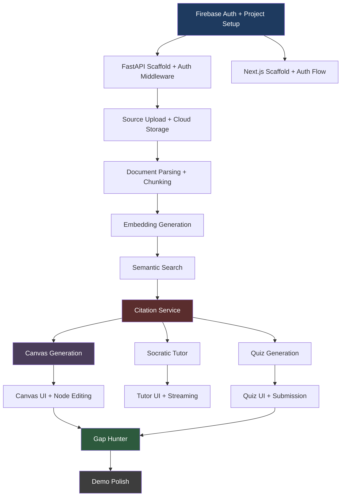

# Phase 1 — V1 Product Contract

> **Historical v1 document.** This file describes the superseded v1 `Synthesis Studio` direction and is retained as a historical record. For the current product direction, use the v2 docs stack starting with [v2-master-brief.md](./v2-master-brief.md).

> **Codename:** Synthesis Studio
> **Contract Version:** 1.0.0
> **Date:** 2026-04-07
> **Governing Document:** [phase-0-master-implementation-brief.md](./phase-0-master-implementation-brief.md)
> **Status:** Binding — all implementation phases must conform to this contract

---

## 1. Product Contract Summary

### Definition of V1

Synthesis Studio v1 is a single-user, single-notebook web application where a student uploads PDF/PPTX/DOCX study materials and engages with them through exactly five structured interactions: a Synthesis Canvas (AI-generated skeleton concept map that the student must complete), a Socratic Tutor (source-grounded questioning that gives hints before answers), a Quiz Engine (auto-generated MCQ and open-ended questions with exact citations), a Gap Hunter (knowledge gap detector based on canvas and quiz coverage), and a Citation System (every AI output links to exact source chunks). There is no open-ended chat. There is no teacher view. There is one user, one notebook at a time, one active learning loop.

### What V1 Is Trying to Prove

Three hypotheses, in priority order:

1. **Desirable difficulty converts.** Students will choose a structured active-learning tool over a free-form chatbot *if* the first concept map feels magical and the interaction loop is rewarding.
2. **Source-grounded trust.** Exact citations at chunk level create qualitatively higher trust than LLM-only answers.
3. **Demoable vertical slice.** The upload-to-gap-hunter loop is compelling enough to demonstrate in 5 minutes to any audience.

---

## 2. In-Scope Features

### F1: Source Upload

| Field | Value |
|---|---|
| **Purpose** | Get the student's own material into the system and ready for structured learning. |
| **Minimal User Value** | Student uploads a PDF and sees it broken into readable, structured chunks within 30 seconds. |
| **V1 Must Do** | Accept PDF, PPTX, DOCX files (max 50 MB each per file, max 5 files per notebook). Parse with structure preservation (sections, headers, paragraphs). Chunk semantically (~500 tokens, sentence boundaries). Generate embeddings. Store chunks in Firestore. Show processing status. Display chunk list with page numbers and section titles. |
| **Intentionally Excluded in V1** | Audio/video files. Web URLs. Plain text paste (can be added trivially but is not demo-critical). OCR for scanned PDFs. Batch upload of 10+ files. Source editing after upload. |

### F2: Exact Citations

| Field | Value |
|---|---|
| **Purpose** | Every AI-generated output earns trust by linking to the exact source passage. |
| **Minimal User Value** | Student sees a citation badge on any AI output, clicks it, and sees the exact source paragraph highlighted. |
| **V1 Must Do** | Store citations as `(outputId, chunkId, relevanceScore)`. Validate all chunk_ids server-side — strip any that don't exist. Render clickable citation badges in Canvas nodes, Tutor messages, Quiz explanations, and Gap results. Citation popover shows: source title, page number, section title, and the chunk text. |
| **Intentionally Excluded in V1** | Citation accuracy scoring/analytics. Citation export. Highlighted PDF viewer (v1 shows chunk text only, not the rendered PDF page). Cross-notebook citation search. |

### F3: Synthesis Canvas

| Field | Value |
|---|---|
| **Purpose** | The core product experience — an interactive concept map where the student builds understanding. |
| **Minimal User Value** | Student clicks one button and sees their material transformed into a visual knowledge structure with intentional gaps they must fill. |
| **V1 Must Do** | Generate a skeleton concept map from uploaded sources (10–15 nodes, 12–18 edges). Include 2–4 intentionally blank ("skeleton") nodes and 1–2 unlabeled edges. Student can click a skeleton node, see a guiding question, type their answer, and link it to a source citation. Node status transitions: `skeleton` → `student_filled`. Nodes are draggable. Canvas is zoomable/pannable. Student can add their own nodes and edges. Each node displays citation badges. Canvas shows a completion indicator (X/Y nodes filled). |
| **Intentionally Excluded in V1** | Canvas versioning/history. Undo/redo. Canvas export (image/PDF). Multiple canvas views per notebook. Canvas diffing. Node grouping/clustering. Auto-layout algorithms beyond initial placement. |

### F4: Socratic Tutor

| Field | Value |
|---|---|
| **Purpose** | AI-powered questioning that probes understanding instead of delivering answers. |
| **Minimal User Value** | Student asks a question about their material and the tutor responds with a guiding question or hint, not a direct answer. |
| **V1 Must Do** | Open a tutor session scoped to current notebook sources. Tutor initiates with a question about the material. Student sends messages; tutor responds with questions, hints, challenges, or redirects to source material. All tutor messages include citations. Streaming response (SSE). Tutor must refuse to give direct answers — it must redirect to source passages or ask follow-up questions. Maximum 20 messages per session (prevents infinite loops). "Show me the relevant passage" escape valve: student can request the source text (but NOT the answer). |
| **Intentionally Excluded in V1** | Multiple simultaneous sessions. Tutor personality customization. Voice input/output. Tutor memory across sessions. Frustration detection (desirable but not blocking for demo). |

### F5: Quiz / Flashcards

| Field | Value |
|---|---|
| **Purpose** | Retrieval practice grounded in the student's own sources. |
| **Minimal User Value** | Student generates a quiz from their material, answers questions, sees immediate feedback with source citations. |
| **V1 Must Do** | Generate 5–10 quiz items per batch from selected sources. Support MCQ (4 options) and open-ended question types. Show correct answer + explanation + citations after submission. Track quiz attempts (quizItemId, userAnswer, isCorrect). Display quiz results summary (X/Y correct). Each question cites specific source chunks. Difficulty spread: 40% recall, 40% understanding, 20% application. |
| **Intentionally Excluded in V1** | True/false questions (low pedagogical value, adds UI complexity). Flashcard flip-card UI (quiz cards are sufficient). Spaced repetition scheduling. Quiz history/trends. Timed quizzes. Quiz sharing. |

### F6: Gap Hunter

| Field | Value |
|---|---|
| **Purpose** | Close the learning loop by identifying what the student hasn't covered or understands poorly. |
| **Minimal User Value** | Student clicks "Analyze Gaps" and sees a prioritized list of topics they need to revisit. |
| **V1 Must Do** | Analyze three signals: (1) canvas nodes still in "skeleton" status, (2) quiz items answered incorrectly, (3) source chunks with zero interactions across canvas/tutor/quiz. Output a list of `KnowledgeGap` objects with topic, description, confidence score, and evidence. Allow one-click "Start quiz on this topic" from a gap. Display which sources cover the gap topic. |
| **Intentionally Excluded in V1** | Automatic gap-to-canvas updates. Gap tracking over time. Gap comparison across notebooks. Learning velocity metrics. Recommended study order. |

---

## 3. Out-of-Scope Features

| Feature | Reason | Status |
|---|---|---|
| Multi-user collaboration | Individual cognitive loop first. Adds real-time sync, permissions, conflict resolution. | Postponed v2+ |
| Teacher dashboard / analytics | B2C-first. No institutional users in v1. | Postponed v2 |
| Audio/video source upload | Adds transcription pipeline without changing core loop. | Postponed v2 |
| Mobile native app | Responsive web is sufficient for demo and early adopters. | Postponed v3 |
| Admin dashboard | No institutional customers. | Postponed v3 |
| Payment / subscription system | Manual onboarding for early testers. | Postponed v2 |
| Public sharing / publishing | Single-user product. No sharing model needed. | Postponed v2+ |
| Web scraping as source type | PDF/PPTX/DOCX covers 95% of student material. | Postponed v2 |
| Custom model fine-tuning | Proprietary APIs are the strategy. | Dropped for now |
| Offline mode | Cloud-first product. | Dropped for now |
| Plugin / extension system | Premature abstraction. | Dropped for now |
| SSO beyond Firebase Auth | UNI-Login is Phase 3 institutional. | Postponed v3 |
| Roleplay / scenario simulations | Hard to ground across subjects. | Postponed v2 |
| Image generation / dual coding | Focus on text + diagrams first. | Postponed v2 |
| Spaced repetition scheduling | Quiz *generation* is in scope. Scheduling is v2. | Postponed v2 |
| General chat / ask-anything mode | **Anti-feature.** Destroys product identity. | Rejected permanently for v1 |
| Notification system | No recurring engagement loop needed for demo. | Postponed v2 |
| Multi-language UI | English and Danish *source material* supported. UI is English-only in v1. | Postponed v2 |
| Canvas export (image/PDF) | Nice-to-have, not demo-critical. | Postponed v2 |
| Multiple notebooks per user | v1 allows creation of multiple notebooks but demo focuses on one. CRUD is in scope; optimization is not. | Allowed but not optimized |

---

## 4. User Stories

All stories are from the perspective of a student end-user. No teacher, admin, or institutional stories exist in v1.

### Authentication & Setup

**US-1: Sign up and access the workspace.**
As a student, I want to sign up with Google or email so that I can start using the platform in under 30 seconds.

**US-2: Create a notebook for a subject.**
As a student, I want to create a named notebook (e.g., "Biologi Eksamen") so that all my study materials and learning activities are organized in one place.

### Source Management

**US-3: Upload study materials.**
As a student, I want to upload my PDF lecture slides and textbook chapters so that the platform can process them into structured chunks for active learning.

**US-4: See processing status and results.**
As a student, I want to see a clear progress indicator during processing and then view the extracted chunks with page numbers and section titles so that I trust the system understood my material.

### Synthesis Canvas

**US-5: Generate a concept map from my sources.**
As a student, I want to click one button and see an interactive skeleton concept map generated from my uploaded sources, with some nodes intentionally left blank, so that I have a structured starting point for active learning.

**US-6: Fill in a blank canvas node with evidence.**
As a student, I want to click a skeleton node, see a guiding question, type my answer, and link it to a source citation so that I demonstrate my understanding by reconstructing knowledge from evidence.

**US-7: See which nodes I've completed.**
As a student, I want to see a completion indicator on the canvas (e.g., "8/12 nodes filled") so that I can track my progress and know where to focus.

### Citations

**US-8: View the source evidence behind any AI output.**
As a student, I want to click a citation badge on any canvas node, tutor message, or quiz explanation and see the exact source passage (page number, section title, and text) so that I can verify the claim and study the original material.

### Socratic Tutor

**US-9: Ask for help and receive guidance, not answers.**
As a student, I want to ask the tutor about a concept in my material and receive a probing question or a hint that points me to a specific source passage, not a direct answer, so that I build understanding through my own thinking.

**US-10: Get redirected to source material.**
As a student, I want to use a "Show me the relevant passage" button when I'm stuck so that I can read the original material without being given the answer directly.

### Quiz

**US-11: Generate a quiz from my sources.**
As a student, I want to generate a 5-question quiz from my uploaded sources so that I can test my recall and understanding of the material.

**US-12: See grounded feedback after answering.**
As a student, I want to see whether I'm correct, read an explanation grounded in my sources with exact citations, and understand why the correct answer is right.

### Gap Hunter

**US-13: Discover what I haven't studied yet.**
As a student, I want to analyze my knowledge gaps so that I see a prioritized list of topics I've missed or answered incorrectly, with references to the relevant sources.

**US-14: Start a targeted quiz from a gap.**
As a student, I want to click a knowledge gap and immediately start a quiz focused on that weak area so that I can address my gaps without manual navigation.

---

## 5. Acceptance Criteria

### AC-F1: Source Upload

| ID | Criterion | Verification |
|---|---|---|
| AC-F1.1 | Upload a 10-page PDF. Within 60 seconds, status transitions from "uploading" → "processing" → "ready". | Automated test + manual demo. |
| AC-F1.2 | Upload a 30-slide PPTX. Chunks are created with correct page numbers and section titles. | Manual verification with real Gymnasium material. |
| AC-F1.3 | Upload a file > 50 MB. System rejects with a clear error message. | Automated test. |
| AC-F1.4 | Upload a corrupt/empty file. System transitions to "error" status with a human-readable error message. | Automated test. |
| AC-F1.5 | Chunk viewer displays chunks with: content preview, page range, section title, token count. | Manual UI verification. |

### AC-F2: Exact Citations

| ID | Criterion | Verification |
|---|---|---|
| AC-F2.1 | Every canvas node generated by AI has at least 1 citation badge. | Automated test on canvas generation output. |
| AC-F2.2 | Every tutor message of type "question", "hint", or "challenge" has at least 1 citation. | Automated test on tutor service output. |
| AC-F2.3 | Every quiz explanation has at least 1 citation. | Automated test on quiz generation output. |
| AC-F2.4 | Clicking a citation badge opens a popover showing: source title, page number, section title, chunk text. | Manual UI verification. |
| AC-F2.5 | If the LLM returns a chunk_id that doesn't exist in the user's sources, the backend strips it and the output still renders without error. | Automated test with invalid chunk_id injection. |

### AC-F3: Synthesis Canvas

| ID | Criterion | Verification |
|---|---|---|
| AC-F3.1 | Generating a canvas from 2 uploaded sources produces 10–15 nodes and 12–18 edges, with 2–4 skeleton nodes. | Automated test (run 5 times, check ranges). |
| AC-F3.2 | Student can click a skeleton node, see a guiding question, type an answer, and submit. Node status changes from "skeleton" to "student_filled". | Manual UI test. |
| AC-F3.3 | Canvas nodes are draggable. Canvas supports zoom and pan. | Manual UI test. |
| AC-F3.4 | Completion indicator shows correct count (e.g., "8/12 nodes filled") and updates on node fill. | Manual UI test. |
| AC-F3.5 | Student can add a new node and a new edge manually. | Manual UI test. |
| AC-F3.6 | Canvas loads within 2 seconds for a notebook with 15 nodes and 18 edges. | Performance test. |

### AC-F4: Socratic Tutor

| ID | Criterion | Verification |
|---|---|---|
| AC-F4.1 | Starting a tutor session produces an initial message that is a question about the source material, not a greeting or summary. | Manual test with 5 different source sets. |
| AC-F4.2 | Student sends "What is glycolysis?" and the tutor responds with a question, hint, or source redirect — NOT a definition. | Manual test (red-team with 10 direct-answer-seeking prompts). |
| AC-F4.3 | Tutor messages stream to the UI via SSE. First token appears within 2 seconds. | Manual + timing test. |
| AC-F4.4 | "Show me the relevant passage" button shows the source chunk text without giving the answer. | Manual UI test. |
| AC-F4.5 | Session enforces a 20-message limit. After 20 messages, the session status is "completed" and a new session must be started. | Automated test. |

### AC-F5: Quiz / Flashcards

| ID | Criterion | Verification |
|---|---|---|
| AC-F5.1 | Generating a quiz produces 5 items: at least 3 MCQ and at least 1 open-ended. | Automated test (run 3 times, verify counts and types). |
| AC-F5.2 | Each quiz item has a question, correct answer, explanation, and at least 1 citation. | Automated test on generation output. |
| AC-F5.3 | Submitting an answer returns isCorrect boolean, the correct answer (if wrong), and an explanation with citations. | Automated test. |
| AC-F5.4 | Quiz results summary shows X/Y correct after all items are answered. | Manual UI test. |
| AC-F5.5 | Quiz questions span at least 2 difficulty levels (recall + understanding). | Manual review of generated content. |

### AC-F6: Gap Hunter

| ID | Criterion | Verification |
|---|---|---|
| AC-F6.1 | Running gap analysis on a notebook with 3 unfilled skeleton nodes and 2 incorrect quiz answers produces at least 2 `KnowledgeGap` results. | Automated test with seeded data. |
| AC-F6.2 | Each gap has: topic, description, confidence score (0–1), evidence list, and related source IDs. | Automated test on output shape. |
| AC-F6.3 | Clicking "Start quiz on this topic" generates a quiz filtered to the gap's source chunks. | Manual UI test. |
| AC-F6.4 | Gap analysis completes within 30 seconds for a notebook with 15 nodes, 10 quiz attempts, and 5 sources. | Performance test. |

### AC-SYS: System-Level

| ID | Criterion | Verification |
|---|---|---|
| AC-SYS.1 | All API endpoints return 401 for requests without a valid Firebase Auth token. | Automated test. |
| AC-SYS.2 | User A cannot access User B's notebooks, sources, or quiz data. | Automated test with 2 test users. |
| AC-SYS.3 | Async jobs (source processing, quiz generation, gap analysis) return a jobId. `GET /jobs/:id` shows status progression. | Automated test. |
| AC-SYS.4 | The complete demo flow (Section 6) runs end-to-end without errors. | Manual walkthrough. |

---

## 6. Demo-Critical Flows

The MVP demo is a 5-minute walkthrough demonstrating the full learning loop. Every flow below must work without errors for the demo to be considered ready.

### Flow 1: Authentication

```
User opens app → sees landing page → clicks "Sign in with Google" →
redirected to Google OAuth → returns to dashboard → sees empty notebook list
```

**Success condition:** User is authenticated and sees the dashboard within 5 seconds.

### Flow 2: Notebook Creation

```
User clicks "New Notebook" → types title "Biologi Mundtlig Eksamen" →
clicks Create → redirected to workspace with tabs: Sources, Canvas, Tutor, Quiz, Gaps
```

**Success condition:** Notebook appears in the sidebar. Workspace tabs are visible.

### Flow 3: Source Upload + Processing

```
User navigates to Sources tab → drags a PDF (biology lecture slides) →
sees upload progress → status shows "Processing..." with animation →
within 30 seconds, status changes to "Ready" → chunk count is displayed →
user clicks to expand chunks → sees chunk list with page numbers and section titles
```

**Success condition:** PDF is parsed into 15–50 chunks with page metadata. No error state.

### Flow 4: Second Source Upload

```
User uploads a second PDF (textbook chapter) → same processing flow →
both sources are now listed as "Ready"
```

**Success condition:** Two sources are listed. Both are "Ready".

### Flow 5: Canvas Generation (THE AHA MOMENT)

```
User navigates to Canvas tab → clicks "Generate Concept Map" →
loading animation (5–15 seconds) → skeleton concept map appears →
12–15 nodes with labels, 15+ edges with relationship labels →
3 nodes are marked with "Fill in" status (blank/skeleton) →
1–2 edges have "Define this relationship" labels
```

**Success condition:** Map is visually coherent. Skeleton nodes are visually distinct (different color/border). Canvas is pannable and zoomable.

### Flow 6: Node Interaction

```
User clicks a skeleton node → side panel opens with:
  - Guiding question: "What process produces pyruvate?"
  - "See hint from your sources" link
User clicks hint → sees the relevant chunk text from source
User types "Glycolysis" in the answer field → clicks Submit →
node status changes from skeleton (dashed border) to filled (solid green) →
citation badge appears on the node: "Slides p.14"
```

**Success condition:** Node visually transitions. Citation badge is clickable and shows the correct source passage.

### Flow 7: Evidence Viewing

```
User clicks a citation badge on any filled node →
popover appears showing:
  - Source title: "Biology Lecture Slides"
  - Page: 14
  - Section: "Cellular Respiration - Glycolysis"
  - Chunk text: [exact passage from the source]
```

**Success condition:** The displayed text matches the actual source content. Page number is correct.

### Flow 8: Socratic Tutor

```
User navigates to Tutor tab → session opens with initial message:
  "I see you've been studying cellular respiration. Can you explain
   the relationship between glycolysis and the Krebs cycle using
   your notes? (See: Slides p.14-16)"

User types: "What is the Krebs cycle?"
Tutor responds (streaming, 1–3 seconds):
  "Good question — but let me turn it back to you. Based on section 3.2
   of your textbook chapter, what happens to pyruvate AFTER glycolysis?
   Try to find the intermediate step. (📖 Textbook p.47)"
```

**Success condition:** Tutor does NOT give a direct definition. Tutor references specific pages. Response streams word by word.

### Flow 9: Quiz

```
User navigates to Quiz tab → clicks "Generate Quiz" →
loading (5–10 seconds) → 5 questions appear →
user answers each question → after submission:
  - Correct answers: green checkmark
  - Wrong answers: red X + correct answer + explanation + citation badges
  - Summary: "3/5 correct"
```

**Success condition:** Questions are relevant to the uploaded sources. Citations on each explanation are clickable and point to correct source passages.

### Flow 10: Gap Hunter

```
User navigates to Gaps tab → clicks "Analyze Gaps" →
loading (5–15 seconds) → gap list appears:
  - "⚠ Low coverage: Electron Transport Chain"
    Evidence: 1 unfilled canvas node, 0 quiz attempts on this topic
    Sources: Textbook Chapter p.52–58
  - "⚠ Weak understanding: Pyruvate Processing"
    Evidence: 1/1 quiz incorrect on this topic

User clicks "Start quiz on Electron Transport Chain" →
redirected to Quiz tab with 3 questions focused on that topic
```

**Success condition:** Gaps are meaningful (not generic). Evidence references specific canvas/quiz data. "Start quiz" generates a quiz filtered to the gap topic.

---

## 7. Real vs. Mocked

### Must Be Real in V1

| Component | Rationale |
|---|---|
| Firebase Auth (Google + email) | Demo must show real sign-in. |
| PDF/PPTX/DOCX parsing | Core pipeline — cannot be faked. |
| Semantic chunking with hierarchy metadata | Chunk quality drives everything downstream. |
| Embedding generation (via real LLM API) | Must produce real vectors for search. |
| Semantic search (cosine similarity) | Retrieval correctness drives citation trust. |
| Citation creation + validation | Core differentiator — cannot be mocked. |
| Canvas generation (real LLM call) | The aha moment — must be real. |
| Canvas CRUD (nodes, edges) | Core interaction — must persist to Firestore. |
| Tutor session with streaming (real LLM call) | Pedagogical restraint must be demonstrated. |
| Quiz generation (real LLM call) | Questions must be grounded in real source content. |
| Quiz submission + feedback | Feedback must include real citations. |
| Gap analysis (real LLM call or rule-based) | Must use real canvas and quiz data. |
| Firestore persistence | All data must survive page refresh. |
| User data isolation | User A cannot see User B's data. |

### May Be Mocked Temporarily During Implementation

| Component | What Can Be Mocked | When It Must Become Real |
|---|---|---|
| Cloud Tasks / async job dispatch | Use in-process `asyncio.create_task()` instead of Cloud Tasks during local dev and early Phase 1. | Before Phase 3 polish. Must be real for demo reliability. |
| Second LLM provider (OpenAI) | Implement Gemini only. Stub `OpenAIProvider` as a pass-through or error. | Before v2. Only one provider needed for demo. |
| Vector store infrastructure | Firestore + numpy in-memory cosine similarity is the v1 implementation (per ADR-7). This is not a mock — it's the accepted v1 approach. | Migrate to dedicated vector store in v2 if latency exceeds 500ms at scale. |
| `.txt` file upload | Can be deprioritized below PDF/PPTX/DOCX. | Add if time permits in Phase 2. |
| PPTX/DOCX parsing | Can be stubbed initially if PDF is working. Must be real before demo. | End of Phase 1. |
| Firestore security rules | Can use permissive rules during early dev. | Must be user-scoped before any external access. |
| CI/CD pipelines | Manual deployment is acceptable for demo. | Before any external user testing. |

### Should Not Be Built Yet

| Component | Rationale |
|---|---|
| Qdrant / Pinecone / Vertex Vector Search | Over-engineering for demo scale. |
| Rate limiting / quotas | Use Firebase defaults. |
| Email notifications / webhooks | No engagement loop needed for demo. |
| Admin API / user management | No admin users in v1. |
| Teacher/course API endpoints | No institutional features in v1. |
| Payment processing (Stripe) | Manual onboarding. |
| UNI-Login SAML integration | Phase 3 institutional feature. |
| i18n framework | UI is English-only in v1. Source material can be Danish or English. |
| Analytics / telemetry dashboard | Log to console. No dashboard. |
| Canvas undo/redo system | Adds state complexity. Student can delete nodes manually. |
| Canvas export (image/PDF) | Nice-to-have only. |

---

## 8. UX Guardrails

These rules are binding on all implementation work. Any UI that violates these must be fixed before the demo.

### UX-1: No Chatbot-First Behavior

The landing state of the workspace is the **Sources tab** (before sources exist) or the **Canvas tab** (after sources are processed). There is never a blank chat input as the first thing a user sees. The Socratic Tutor is a side-panel accessible via a dedicated tab, not the default homepage of the workspace.

### UX-2: Serious Academic Aesthetic

The visual design must signal "academic tool for serious study," not "gamified quiz app" or "AI chatbot." Guidelines:
- Dark or neutral color palette. No bright cartoon colors.
- Clean typography (Inter, or system font stack). No playful fonts.
- Dense information layout — not wasteful whitespace.
- No emoji in system-generated content (citation badges use typography, not emoji).
- No confetti, streak counters, or dopamine-farming gamification.
- Professional loading states (skeleton screens, not spinners with "thinking..." text).

### UX-3: Active Learning Over Passive Delivery

Every AI-generated output must require student action. Specific rules:
- Canvas skeleton nodes must be filled by the student — the AI never auto-fills all nodes.
- Tutor never provides a direct answer to a factual question. It gives hints, redirects to sources, or asks follow-up questions.
- Quiz items require student input before showing the answer.
- Gap results lead to actionable paths ("Start quiz on this topic"), not passive summaries.

### UX-4: Citations Visible Where Needed

Citation badges must appear on:
- Every AI-generated canvas node (at least 1 citation each).
- Every tutor message of type question/hint/challenge.
- Every quiz explanation.
- Every gap result.

Citation badges must be clickable, showing a popover with: source title, page number, section title, and chunk text.

### UX-5: Hints Before Direct Answers

When a student interacts with a skeleton node or asks the tutor a question:
1. First response: a guiding question that narrows the scope.
2. If student is stuck: "See hint from your sources" reveals the relevant source passage.
3. The answer itself is never given directly by the tutor. It can only be confirmed after the student provides it.

### UX-6: No Dead Ends

Every screen must have a clear next action:
- Empty Sources tab → "Upload your first document"
- Empty Canvas → "Upload sources to generate a concept map" (disabled Generate button with tooltip)
- Completed quiz → "View your gaps" or "Return to canvas"
- Gap list → "Start quiz on this topic" for each gap

### UX-7: Progress Visibility

The student must always be able to see where they are:
- Canvas: completion indicator (X/Y nodes filled)
- Quiz: progress (question 3/5) and results (3/5 correct)
- Sources: processing status per source
- Gaps: count of identified gaps

---

## 9. Technical Guardrails

These constraints are binding on all implementation work. Code that violates these must be refactored before merging.

### TG-1: Modular Provider Abstraction

All LLM calls must go through the `LLMProvider` abstract class defined in `backend/app/providers/base.py`. No direct `import google.generativeai` or `import openai` outside of provider implementations. Prompt templates must live in `backend/app/prompts/`, not in provider or service code.

### TG-2: No Vendor Lock-in in Domain Logic

Service code (`backend/app/services/`) must not import provider-specific modules. Services receive an `LLMProvider` instance via dependency injection. The same service logic must work regardless of whether the provider is Gemini, OpenAI, or a future open-source model.

### TG-3: Notebook-Scoped Retrieval

All semantic search must be scoped to the sources attached to the current notebook. No cross-notebook search. No global search. The search endpoint requires `sourceIds` as a mandatory parameter, and all source IDs must belong to the authenticated user's notebook.

### TG-4: No Fabricated Citations

Every citation returned to the frontend must reference a `chunkId` that exists in the user's sources. The `citation_service` must validate all chunk_ids before creating `Citation` objects. If the LLM returns a chunk_id that doesn't exist, the citation is silently dropped — the system never renders a citation pointing to nonexistent content.

### TG-5: Clean API Boundaries

All backend endpoints follow the REST patterns defined in the Phase 0 brief (Section 7). No endpoint may return data from a bounded context it doesn't own. SourceIngestion endpoints return Source/Chunk data. SynthesisWorkspace endpoints return Notebook/Node/Edge data. ActiveLearning endpoints return TutorSession/QuizItem/KnowledgeGap data. KnowledgeRetrieval provides search results and citation resolution cross-cutting services.

### TG-6: Async Processing for Heavy Operations

The following operations must be asynchronous (return a `jobId`, process in background):
- Source processing (parse → chunk → embed)
- Quiz batch generation
- Gap analysis
- Canvas generation

The following operations must be synchronous:
- Auth, CRUD reads/writes, chunk search, tutor streaming, quiz submission

### TG-7: User Data Isolation

Firestore security rules must enforce that `userId == request.auth.uid` on all reads and writes. Backend must validate `userId` from the Firebase Auth token on every request. No endpoint may return data belonging to another user.

### TG-8: Stateless Backend

The FastAPI backend must not store any state in memory between requests (except for in-process async tasks during development). All persistent state lives in Firestore. No server-side sessions. No in-memory caches that affect correctness (caching for performance is acceptable only if it doesn't violate user isolation).

### TG-9: Structured LLM Output

All LLM calls that produce user-facing content must use structured output where available (Gemini's `response_mime_type: "application/json"`, OpenAI's `response_format`). Free-form text responses are only acceptable for tutor streaming messages. Canvas generation, quiz generation, and gap analysis must return structured JSON that the backend parses and validates.

---

## 10. Build Order Constraints

These dependencies are strict. A later item cannot be built until its dependencies are satisfied.



### Hard Ordering Rules

1. **Auth before everything.** No endpoint works without auth. Build it first.
2. **Ingestion before retrieval.** Without chunks and embeddings, search returns nothing.
3. **Search before AI features.** Canvas, tutor, quiz, and gaps all depend on retrieval.
4. **Citations before polished AI outputs.** If citations don't work, the tutor/quiz/canvas outputs are untrustworthy.
5. **Canvas before gap hunter.** Gap analysis requires canvas node data as one of its three signal sources.
6. **Quiz before gap hunter.** Gap analysis requires quiz attempt data as one of its three signal sources.
7. **All features before demo polish.** Polish is Phase 3. Do not polish a feature before all features work.

### What Can Be Parallelized

- Frontend scaffold (C) can be built in parallel with backend scaffold (B).
- Canvas UI (L), Tutor UI (M), and Quiz UI (N) can be built in parallel once the citation service (H) is ready, as long as the backend APIs for each are built in sequence.
- Frontend component libraries (UI primitives, citation badge) can be built anytime.

---

## 11. Launch Blockers

The following conditions must ALL be met before the demo is considered ready. If any one is false, the MVP is not launchable.

| ID | Blocker | Description |
|---|---|---|
| LB-1 | **Source upload does not complete** | If uploading a well-formed 10-page PDF does not produce chunks with page metadata within 60 seconds, the pipeline is broken. Nothing downstream works. |
| LB-2 | **Canvas generation fails or produces garbage** | If the skeleton concept map has fewer than 5 coherent nodes, or edges don't connect to relevant nodes, or no skeleton nodes are generated, the aha moment is dead. |
| LB-3 | **Citations are broken** | If clicking a citation badge shows the wrong passage or no passage, the core trust differentiator is gone. |
| LB-4 | **Tutor gives direct answers** | If the Socratic tutor answers "What is glycolysis?" with a definition instead of a guiding question, the pedagogical model has failed. Must pass red-team test: <10% of 20 direct-answer prompts leak answers. |
| LB-5 | **Quiz questions are not source-grounded** | If quiz questions reference information not present in the uploaded sources, the "grounded outputs" thesis is disproven. |
| LB-6 | **User data leaks across accounts** | If User A can see User B's notebooks or sources, the product is not safe to demo externally. |
| LB-7 | **Demo flow crashes** | If the complete 10-step demo flow (Section 6) cannot be completed without errors, the MVP is not ready. |
| LB-8 | **Canvas is not interactive** | If nodes cannot be dragged, clicked, or filled, the canvas is a static image, not a product. |
| LB-9 | **Gap Hunter produces zero results** | If gap analysis returns an empty list on a notebook with unfilled skeleton nodes and incorrect quiz answers, the learning loop is incomplete. |

---

## 12. Final Product Contract

### V1 Is

**Synthesis Studio v1 is a single-user web application where a student uploads study materials and engages with them through a source-grounded synthesis canvas, Socratic tutor, quiz engine, and gap hunter — every AI output backed by exact citations, every interaction designed to make the student think rather than passively consume.**

### V1 Is NOT

**V1 is NOT a chatbot, NOT a teacher tool, NOT an institutional platform, NOT a grading system, and NOT a general-purpose AI assistant — it is a pedagogically-restrained, citation-grounded, active-learning workspace for a single student preparing for an exam.**
