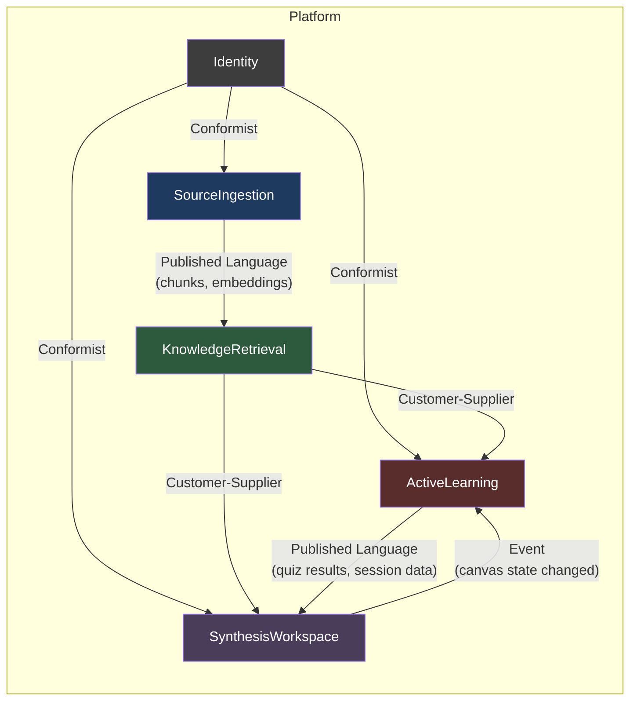

# Phase 2 — Technical Architecture Pack

> **Historical v1 document.** This file describes the superseded v1 `Synthesis Studio` direction and is retained as a historical record. For the current product direction, use the v2 docs stack starting with [v2-master-brief.md](./v2-master-brief.md).

> **Codename:** Synthesis Studio
> **Version:** 2.0.0
> **Date:** 2026-04-07
> **Governing Documents:** [phase-0-master-implementation-brief.md](./phase-0-master-implementation-brief.md), [phase-1-v1-product-contract.md](./phase-1-v1-product-contract.md)
> **Status:** Binding — all implementation agents must conform to this architecture

---

## 1. Architecture Overview

Synthesis Studio v1 is a three-tier web application: a Next.js 14+ App Router frontend serving an interactive concept-map workspace, a stateless FastAPI backend running on Cloud Run that orchestrates document processing, LLM-powered generation, and source-grounded retrieval, and a Firebase persistence layer (Auth, Firestore, Cloud Storage) that owns all state. The architecture optimizes for **demo reliability** (every flow must work end-to-end without failure), **citation correctness** (every AI output traces to validated source chunks), and **provider portability** (all LLM calls pass through an abstraction layer). It explicitly does NOT optimize for multi-user scale, real-time collaboration, horizontal backend scaling, or institutional access patterns. Every component is notebook-scoped: retrieval, generation, and storage are bounded by a single user's single notebook.

---

## 2. Bounded Contexts

### Context Map



### 2.1 SourceIngestion

| Field | Value |
|---|---|
| **Responsibility** | Accept document uploads, parse with structure preservation, chunk semantically, generate embeddings, store chunks and metadata. |
| **Owns** | `Source`, `Chunk`, `ProcessingJob` (type: source_processing) |
| **Main Inputs** | File upload (PDF/PPTX/DOCX), notebookId, userId |
| **Main Outputs** | Parsed chunks with embeddings, source status events, processing job updates |
| **Dependencies** | Identity (userId validation), LLM Provider (embeddings) |
| **Must NOT Own** | Citations, canvas nodes, quiz items, search logic |

### 2.2 KnowledgeRetrieval

| Field | Value |
|---|---|
| **Responsibility** | Notebook-scoped semantic search over chunks. Citation creation, validation, and resolution. Context assembly for downstream AI calls. |
| **Owns** | `Citation`, vector index (in-memory), search ranking logic |
| **Main Inputs** | Query string + sourceIds from any consumer context |
| **Main Outputs** | Ranked chunk results (EvidencePack), validated Citation objects |
| **Dependencies** | SourceIngestion (reads chunks and embeddings) |
| **Must NOT Own** | Source files, embedding generation, canvas state, tutor logic |

### 2.3 ActiveLearning

| Field | Value |
|---|---|
| **Responsibility** | Socratic tutoring sessions, quiz generation, gap analysis. All AI interactions with pedagogical restraint. |
| **Owns** | `TutorSession`, `TutorMessage`, `QuizItem`, `QuizAttempt`, `KnowledgeGap`, `ProcessingJob` (types: quiz_generation, gap_analysis) |
| **Main Inputs** | EvidencePack from KnowledgeRetrieval, student messages, quiz submissions, canvas state (read-only) |
| **Main Outputs** | Tutor messages (streaming), quiz items with citations, gap reports |
| **Dependencies** | KnowledgeRetrieval (source-grounded context), Identity, SynthesisWorkspace (reads canvas state for gap analysis) |
| **Must NOT Own** | Source parsing, canvas nodes/edges, citation validation logic |

### 2.4 SynthesisWorkspace

| Field | Value |
|---|---|
| **Responsibility** | Notebook CRUD. Canvas state management including concept map generation, node/edge CRUD, and completion tracking. |
| **Owns** | `Notebook`, `SynthesisNode`, `SynthesisEdge`, `ProcessingJob` (type: canvas_generation) |
| **Main Inputs** | User CRUD requests, canvas generation requests, EvidencePack from KnowledgeRetrieval |
| **Main Outputs** | Canvas state (nodes + edges), completion indicators, notebook metadata |
| **Dependencies** | KnowledgeRetrieval (for linking nodes to citations), Identity |
| **Must NOT Own** | Source files, chunks, tutor sessions, quiz items |

### 2.5 Identity

| Field | Value |
|---|---|
| **Responsibility** | Authentication and user profile. Thin delegation layer to Firebase Auth. |
| **Owns** | `UserProfile` |
| **Main Inputs** | Firebase Auth tokens |
| **Main Outputs** | Validated userId, user preferences |
| **Dependencies** | Firebase Auth (external) |
| **Must NOT Own** | Any domain entity. No business logic. |

---

## 3. System Components

### 3.1 Frontend App — Next.js 14+

- **Runtime:** App Router with hybrid RSC + client components
- **RSC pages:** Dashboard (notebook list), source list, quiz results, gap results
- **Client pages:** Canvas (React Flow), Tutor (streaming SSE), Quiz interaction
- **State management:** Zustand for canvas local state (node positions, zoom), `useSWR` for server data cache
- **Auth:** Firebase Auth JS SDK, token forwarded as `Authorization: Bearer` header
- **Styling:** Tailwind CSS with design tokens for academic aesthetic
- **Key libraries:** `@xyflow/react` (React Flow v12+), `useSWR`, Firebase JS SDK

### 3.2 Backend API — FastAPI

- **Runtime:** Python 3.11+, uvicorn, deployed on Cloud Run
- **Architecture:** Stateless. All state in Firestore. No server-side sessions.
- **Auth middleware:** Validates Firebase ID tokens on every request via `firebase-admin` SDK
- **API versioning:** All endpoints under `/api/v1/`
- **Response format:** JSON. Streaming SSE for tutor messages only.
- **Dependency injection:** `LLMProvider`, `FirestoreClient`, `StorageClient` injected via FastAPI `Depends()`

### 3.3 Ingestion / Processing Jobs

- **v1 implementation:** In-process `asyncio.create_task()` for local dev. Cloud Tasks dispatch in production.
- **Job types:** `source_processing`, `canvas_generation`, `quiz_generation`, `gap_analysis`
- **Pattern:** Endpoint returns `{ jobId }` immediately. Background task updates `jobs/{jobId}` document in Firestore. Frontend polls `GET /api/v1/jobs/:jobId`.
- **Retry:** Cloud Tasks handles retry with exponential backoff. In-process tasks: no retry in v1.

### 3.4 Retrieval Layer

- **v1 implementation:** Load chunk embeddings from Firestore into memory, compute cosine similarity with numpy.
- **Scope:** Always notebook-scoped. `sourceIds` is a mandatory parameter.
- **Output:** `EvidencePack` — a ranked list of chunks with metadata, used by all downstream generation.
- **Top-K:** Default 10 chunks. Adjustable per call.

### 3.5 Generation Layer (Tutor / Canvas / Quiz / Gaps)

- **All generation calls:** Receive an `EvidencePack` + task-specific parameters. Return structured JSON (except tutor streaming).
- **Provider abstraction:** All calls go through `LLMProvider.generate()` or `LLMProvider.stream_generate()`.
- **Prompt templates:** Stored in `backend/app/prompts/`. Never in provider or service code.
- **Citation enforcement:** Every generation prompt includes chunk_ids in context. Backend validates returned chunk_ids.

### 3.6 Storage Layers

| Store | Technology | Purpose |
|---|---|---|
| Document Store | Firestore | All domain entities (notebooks, nodes, sources, chunks, sessions, quiz items, gaps, jobs, users) |
| File Store | Cloud Storage | Uploaded PDF/PPTX/DOCX files |
| Vector Store | Firestore fields + numpy | Chunk embeddings stored as float arrays in Firestore. In-memory cosine similarity for search. |
| Auth Store | Firebase Auth | User credentials, OAuth tokens |

### 3.7 Auth Layer

- Firebase Auth handles all authentication (email/password, Google OAuth).
- Backend validates Firebase ID tokens via `firebase-admin.auth.verify_id_token()`.
- Frontend sends `Authorization: Bearer <idToken>` on every API call.
- Firestore security rules enforce `userId == request.auth.uid`.
- No custom session management. No JWT minting. No role-based access (single role: student).

### 3.8 Provider Abstraction Layer

All external service calls are behind abstract interfaces. See Section 11 for full interface definitions.

---

## 4. Deployment Architecture

### Firebase Responsibilities

| Service | Responsibility |
|---|---|
| Firebase Auth | User authentication (Google + email) |
| Firestore | All persistent state (documents, chunks, sessions, jobs) |
| Cloud Storage | Uploaded source files |
| Vercel | Next.js frontend |

### Cloud Run Responsibilities

| Service | Responsibility |
|---|---|
| Cloud Run (single service) | FastAPI backend. All API endpoints. Processing jobs (in-process async). |

### Environment Separation

| Environment | Backend | Frontend | Database | Notes |
|---|---|---|---|---|
| **Local** | `uvicorn` on localhost:8000 | `next dev` on localhost:3000 | Firebase Emulator Suite | No real LLM calls by default; use env flag to enable |
| **Dev** | Cloud Run (dev project) | Vercel (dev/preview) | Firestore (dev project) | Real LLM calls with low quotas |
| **Staging** | Cloud Run (staging project) | Vercel (staging/preview) | Firestore (staging project) | Mirror of prod for demo rehearsal |
| **Prod** | Cloud Run (prod project, EU region) | Vercel (prod) | Firestore (prod, `europe-west1`) | Demo-ready |

### Region

All production resources in `europe-west1` (Belgium) or `europe-north1` (Finland) for GDPR compliance.

---

## 5. Sync vs. Async Flows

| Operation | Mode | Rationale |
|---|---|---|
| Notebook CRUD | **Sync** | Instant response, small payload |
| Source upload (file transfer) | **Sync** | File goes to Cloud Storage, returns sourceId |
| Source processing (parse → chunk → embed) | **Async (jobId)** | 10–60s depending on document size |
| Chunk listing / retrieval | **Sync** | Read from Firestore |
| Semantic search | **Sync** | In-memory numpy, <500ms for <5K chunks |
| Citation resolution | **Sync** | Single Firestore read |
| Canvas generation | **Async (jobId)** | LLM call + structured output parsing, 5–15s |
| Canvas node CRUD | **Sync** | Single Firestore write |
| Tutor session creation | **Sync** | Creates session doc + streams initial message |
| Tutor message exchange | **Sync (streaming SSE)** | Real-time interaction via server-sent events |
| Quiz generation | **Async (jobId)** | LLM call for 5–10 items, 5–10s |
| Quiz submission | **Sync** | Evaluate answer, return feedback |
| Gap analysis | **Async (jobId)** | Reads canvas + quiz data + optionally calls LLM, 5–15s |
| Job status polling | **Sync** | Read job document from Firestore |

### Async Job Flow

```
1. Client → POST /api/v1/{resource}/generate → 202 { jobId }
2. Backend creates jobs/{jobId} in Firestore (status: "pending")
3. Backend dispatches background task (asyncio.create_task or Cloud Tasks)
4. Background task updates jobs/{jobId}: "pending" → "running" → "completed"/"failed"
5. Client polls GET /api/v1/jobs/{jobId} until terminal state
6. Client fetches generated resource
```

---

## 6. Data Model Proposal

### 6.1 User (Identity Context)

| Field | Type | Purpose |
|---|---|---|
| `id` | string | Firebase Auth UID |
| `email` | string | User email |
| `displayName` | string | Display name |
| `createdAt` | timestamp | Account creation |
| `preferences.language` | `"da" \| "en"` | UI language preference |
| `usage.sourcesUploaded` | number | Counter |
| `usage.quizzesTaken` | number | Counter |

**Collection:** `users/{userId}`

### 6.2 Notebook (SynthesisWorkspace Context)

| Field | Type | Purpose |
|---|---|---|
| `id` | string | Auto-generated |
| `userId` | string | Owner |
| `title` | string | User-defined title |
| `description` | string | Optional description |
| `sourceIds` | string[] | Attached sources |
| `status` | `"active" \| "archived"` | Lifecycle |
| `createdAt` | timestamp | |
| `updatedAt` | timestamp | |

**Collection:** `notebooks/{notebookId}`
**Subcollections:** `/nodes`, `/edges`, `/tutorSessions`, `/quizItems`, `/quizAttempts`, `/gaps`, `/citations`

### 6.3 Source (SourceIngestion Context)

| Field | Type | Purpose |
|---|---|---|
| `id` | string | Auto-generated |
| `userId` | string | Owner |
| `notebookId` | string | Parent notebook |
| `title` | string | Display title |
| `fileName` | string | Original filename |
| `fileType` | `"pdf" \| "pptx" \| "docx"` | Format |
| `storagePath` | string | Cloud Storage path |
| `status` | `"uploading" \| "processing" \| "ready" \| "error"` | Pipeline state |
| `chunkCount` | number | Populated after processing |
| `errorMessage` | string \| null | Error detail |
| `createdAt` | timestamp | |
| `processedAt` | timestamp \| null | |

**Collection:** `sources/{sourceId}`
**Subcollection:** `/chunks`

### 6.4 ProcessingJob

| Field | Type | Purpose |
|---|---|---|
| `id` | string | Auto-generated |
| `userId` | string | Owner |
| `type` | `"source_processing" \| "canvas_generation" \| "quiz_generation" \| "gap_analysis"` | Job type |
| `status` | `"pending" \| "running" \| "completed" \| "failed"` | Lifecycle |
| `targetId` | string | sourceId, notebookId, etc. |
| `progress` | number (0–100) | Optional progress |
| `result` | object \| null | Output data |
| `error` | string \| null | Error detail |
| `createdAt` | timestamp | |
| `completedAt` | timestamp \| null | |

**Collection:** `jobs/{jobId}`

### 6.5 Chunk (SourceIngestion Context)

| Field | Type | Purpose |
|---|---|---|
| `id` | string | Auto-generated |
| `sourceId` | string | Parent source |
| `userId` | string | Owner (for security rules) |
| `content` | string | Raw text |
| `tokenCount` | number | For budgeting |
| `embedding` | number[] | Float32 array |
| `position.pageStart` | number | |
| `position.pageEnd` | number | |
| `position.sectionTitle` | string \| null | |
| `position.chapterTitle` | string \| null | |
| `position.paragraphIndex` | number | |
| `metadata.language` | `"da" \| "en" \| "unknown"` | Detected language |
| `metadata.hierarchyPath` | string[] | e.g. `["Chapter 3", "Section 3.2"]` |
| `createdAt` | timestamp | |

**Collection:** `sources/{sourceId}/chunks/{chunkId}`

### 6.6 Citation (KnowledgeRetrieval Context)

| Field | Type | Purpose |
|---|---|---|
| `id` | string | Auto-generated |
| `notebookId` | string | Scope |
| `outputType` | `"canvas_node" \| "tutor_message" \| "quiz_item" \| "gap_result"` | What produced this |
| `outputId` | string | ID of the producing entity |
| `chunkId` | string | Referenced chunk |
| `sourceId` | string | Referenced source |
| `sourceTitle` | string | Denormalized |
| `pageStart` | number | Denormalized from chunk |
| `pageEnd` | number | |
| `sectionTitle` | string \| null | |
| `relevanceScore` | number (0–1) | |
| `createdAt` | timestamp | |

**Collection:** `notebooks/{notebookId}/citations/{citationId}`

### 6.7 SynthesisNode (SynthesisWorkspace Context)

| Field | Type | Purpose |
|---|---|---|
| `id` | string | |
| `notebookId` | string | |
| `type` | `"concept" \| "question" \| "evidence" \| "summary" \| "gap_marker"` | Node category |
| `label` | string | Display label |
| `content` | string | Full content / student answer |
| `guidingQuestion` | string \| null | Question shown for skeleton nodes |
| `status` | `"skeleton" \| "student_filled" \| "ai_generated" \| "verified"` | Progression |
| `positionX` | number | Canvas position |
| `positionY` | number | |
| `citationIds` | string[] | Links to Citation docs |
| `createdBy` | `"ai" \| "student"` | |
| `createdAt` | timestamp | |
| `updatedAt` | timestamp | |

**Collection:** `notebooks/{notebookId}/nodes/{nodeId}`

### 6.8 SynthesisEdge (SynthesisWorkspace Context)

| Field | Type | Purpose |
|---|---|---|
| `id` | string | |
| `notebookId` | string | |
| `sourceNodeId` | string | |
| `targetNodeId` | string | |
| `label` | string | Relationship description |
| `status` | `"skeleton" \| "student_labeled" \| "ai_generated"` | |
| `createdBy` | `"ai" \| "student"` | |
| `createdAt` | timestamp | |

**Collection:** `notebooks/{notebookId}/edges/{edgeId}`

### 6.9 TutorSession (ActiveLearning Context)

| Field | Type | Purpose |
|---|---|---|
| `id` | string | |
| `notebookId` | string | |
| `userId` | string | |
| `focusArea` | string | Topic or chunk reference |
| `sourceIds` | string[] | Sources in scope |
| `status` | `"active" \| "completed"` | |
| `messageCount` | number | Max 20 |
| `hintLevel` | number (0–3) | Current hint ladder position |
| `createdAt` | timestamp | |
| `updatedAt` | timestamp | |

**Collection:** `notebooks/{notebookId}/tutorSessions/{sessionId}`

### 6.10 TutorMessage (ActiveLearning Context)

| Field | Type | Purpose |
|---|---|---|
| `id` | string | |
| `sessionId` | string | |
| `role` | `"tutor" \| "student"` | |
| `content` | string | |
| `messageType` | `"question" \| "hint" \| "challenge" \| "affirmation" \| "redirect" \| "student_response"` | |
| `citationIds` | string[] | |
| `createdAt` | timestamp | |

**Collection:** `notebooks/{notebookId}/tutorSessions/{sessionId}/messages/{messageId}`

### 6.11 QuizItem (ActiveLearning Context)

| Field | Type | Purpose |
|---|---|---|
| `id` | string | |
| `notebookId` | string | |
| `sourceIds` | string[] | Sources used |
| `questionType` | `"mcq" \| "open_ended"` | |
| `question` | string | |
| `options` | string[] \| null | MCQ options |
| `correctAnswer` | string | |
| `explanation` | string | |
| `citationIds` | string[] | |
| `difficulty` | `"recall" \| "understanding" \| "application"` | |
| `bloomLevel` | number (1–6) | |
| `createdAt` | timestamp | |

**Collection:** `notebooks/{notebookId}/quizItems/{quizItemId}`

### 6.12 QuizAttempt (ActiveLearning Context)

| Field | Type | Purpose |
|---|---|---|
| `id` | string | |
| `notebookId` | string | |
| `userId` | string | |
| `quizItemId` | string | |
| `userAnswer` | string | |
| `isCorrect` | boolean | |
| `timeTakenMs` | number | |
| `attemptNumber` | number | |
| `createdAt` | timestamp | |

**Collection:** `notebooks/{notebookId}/quizAttempts/{attemptId}`

### 6.13 KnowledgeGap (ActiveLearning Context)

| Field | Type | Purpose |
|---|---|---|
| `id` | string | |
| `notebookId` | string | |
| `userId` | string | |
| `topic` | string | |
| `description` | string | |
| `confidence` | number (0–1) | How confident we are this is a gap |
| `evidence` | `GapEvidence[]` | Array of `{ type, referenceId, detail }` |
| `sourceIds` | string[] | Sources covering this topic |
| `status` | `"identified" \| "acknowledged" \| "addressed"` | |
| `createdAt` | timestamp | |

**Collection:** `notebooks/{notebookId}/gaps/{gapId}`

`GapEvidence.type`: `"quiz_failure" | "canvas_empty" | "tutor_struggle" | "low_coverage"`

---

## 7. Retrieval and Grounding Architecture

### 7.1 Notebook-Scoped Retrieval

All retrieval calls require `sourceIds: string[]`. The search service loads chunks ONLY from the specified sources. No cross-notebook or cross-user search exists.

### 7.2 Chunk Selection Approach

```
1. Receive query + sourceIds
2. Load all chunk embeddings from Firestore for the given sourceIds (cached per request if multiple calls)
3. Embed the query using LLMProvider.embed()
4. Compute cosine similarity (numpy) against all loaded chunks
5. Return top-K chunks (default K=10), filtered by similarity threshold ≥ 0.3
6. Include chunk metadata (pageStart, pageEnd, sectionTitle, sourceTitle)
```

### 7.3 EvidencePack Structure

The standard data structure passed from KnowledgeRetrieval to all generation services:

```python
@dataclass
class EvidenceChunk:
    chunk_id: str
    source_id: str
    source_title: str
    content: str
    page_start: int
    page_end: int
    section_title: str | None
    similarity_score: float

@dataclass
class EvidencePack:
    query: str
    chunks: list[EvidenceChunk]  # ranked by similarity
    source_ids: list[str]
    notebook_id: str
```

### 7.4 Citation Traceability Rules

1. Every LLM prompt that generates user-facing content receives chunk_ids in the context block.
2. The prompt instructs the model to return chunk_ids alongside each claim.
3. The `citation_service` validates every returned chunk_id against the user's sources.
4. Invalid chunk_ids are silently stripped. No error is raised.
5. If ALL chunk_ids are invalid, the output is still returned but with zero citations and a `low_confidence: true` flag.
6. Citations are stored as separate `Citation` documents in the notebook subcollection.

### 7.5 Answerability Threshold

If the EvidencePack returns fewer than 2 chunks with similarity > 0.3, the system treats the query as **insufficiently grounded**. Behavior:
- **Tutor:** Responds with "I can't find enough information about that in your sources. Could you rephrase, or try uploading more material on this topic?"
- **Canvas generation:** Omits the concept rather than hallucinating a node.
- **Quiz generation:** Skips the topic; generates fewer items rather than ungrounded ones.
- **Gap Hunter:** Flags the topic as "low_coverage" evidence.

### 7.6 Multilingual Danish/English Considerations

- **Embedding model:** Use `text-embedding-004` (Vertex AI) which supports Danish and English natively.
- **Query-document language mismatch:** The embedding model handles cross-lingual similarity. No explicit translation step is needed for retrieval.
- **Prompts:** All LLM prompts include the instruction: "The source material may be in Danish or English. Respond in the same language as the student's query. Cite sources in their original language."
- **Chunk language detection:** Store `metadata.language` on each chunk during parsing (simple heuristic based on character frequency or `langdetect`). Used for logging/monitoring, not for filtering.

---

## 8. Synthesis Canvas Contracts

### 8.1 Node Schema (Frontend)

```typescript
interface CanvasNodeData {
  id: string;
  label: string;
  content: string;
  guidingQuestion: string | null;
  status: "skeleton" | "student_filled" | "ai_generated" | "verified";
  type: "concept" | "question" | "evidence" | "summary" | "gap_marker";
  citationIds: string[];
  createdBy: "ai" | "student";
}
```

**React Flow integration:** Custom node component renders based on `status`:
- `skeleton` → dashed border, muted color, "Fill in" prompt visible
- `student_filled` → solid green border, citation badge visible
- `ai_generated` → solid default border, citation badge visible
- `verified` → checkmark icon, fully styled

### 8.2 Edge Schema (Frontend)

```typescript
interface CanvasEdgeData {
  id: string;
  label: string;
  status: "skeleton" | "student_labeled" | "ai_generated";
  createdBy: "ai" | "student";
}
```

- `skeleton` edges render with dashed style and "Define this relationship" label
- `student_labeled` and `ai_generated` edges render solid

### 8.3 Uncertainty Representation

- Skeleton nodes: dashed border, reduced opacity, guiding question shown on hover/click
- Skeleton edges: dashed line, label in italics
- Completion indicator in toolbar: "8/12 nodes completed"

### 8.4 Evidence Drawer Contract

Clicking any node or citation badge opens a side panel showing:

```typescript
interface EvidenceDrawerData {
  nodeId: string;
  nodeLabel: string;
  guidingQuestion: string | null;
  citations: {
    citationId: string;
    sourceTitle: string;
    pageStart: number;
    pageEnd: number;
    sectionTitle: string | null;
    chunkText: string;
    relevanceScore: number;
  }[];
  canEdit: boolean; // true for skeleton nodes
}
```

### 8.5 Canvas ↔ Tutor Interaction

- Student clicks a skeleton node → Evidence Drawer opens → student can click "Ask tutor about this"
- This creates a tutor session with `focusArea` set to the node's label/concept
- Tutor receives the node's citation chunks as initial context

### 8.6 Canvas ↔ Retrieval Interaction

- Canvas generation: `POST /notebooks/:id/generate-canvas` calls retrieval with all notebook sourceIds, assembles EvidencePack, passes to canvas generation prompt
- Node fill: student submits answer → backend runs retrieval against student's answer text → validates relevance → creates citations if answer matches source chunks

---

## 9. Socratic Tutor Contracts

### 9.1 Tutor State Model

```
                     ┌──────────────┐
                     │  INITIAL_PROBE│ ← Session start
                     └──────┬───────┘
                            │ student responds
                     ┌──────▼───────┐
                     │  HINT_LEVEL_1 │ ← Generic leading question
                     └──────┬───────┘
                            │ student still struggling
                     ┌──────▼───────┐
                     │  HINT_LEVEL_2 │ ← Partial information + source redirect
                     └──────┬───────┘
                            │ student still struggling
                     ┌──────▼───────┐
                     │  HINT_LEVEL_3 │ ← Specific passage revealed (NOT the answer)
                     └──────┬───────┘
                            │ student provides answer
                     ┌──────▼───────┐
                     │  AFFIRMATION  │ ← Confirms or gently corrects
                     └──────────────┘
```

The `hintLevel` field on `TutorSession` tracks progression (0–3). Transitions are determined by the LLM based on the system prompt, not by hard-coded rules.

### 9.2 Required Backend Inputs

For each tutor message exchange:
- `EvidencePack` assembled from notebook sources (top 10 chunks relevant to `focusArea`)
- Full conversation history (all messages in the session)
- Current `hintLevel`
- System prompt from `backend/app/prompts/tutor_prompts.py`

### 9.3 Allowed Outputs

Tutor messages must be one of these types:
| Type | Description | When Used |
|---|---|---|
| `question` | Probing question about the material | Default first response |
| `hint` | Leading hint that narrows the scope | After student struggles |
| `challenge` | Pushback on a student assertion | When student makes a claim |
| `affirmation` | Confirms correct understanding | When student demonstrates knowledge |
| `redirect` | Points to specific source passage | When student needs source grounding |

**Never allowed:** `answer`, `definition`, `summary`, `explanation` as message types. The tutor never provides direct factual answers.

### 9.4 Citation Requirements

Every tutor message of type `question`, `hint`, `challenge`, or `redirect` MUST include at least 1 citation. `affirmation` messages SHOULD include citations but are not required.

### 9.5 Hint Escalation Rules

1. **Level 0 → 1:** After the initial probe, if the student's response shows confusion or asks "what is X?", escalate to a leading question.
2. **Level 1 → 2:** If the student's second response is still off-track, reveal partial information from the source and point to a specific section.
3. **Level 2 → 3:** If the student uses "Show me the relevant passage," display the source chunk text but NOT a synthesized answer.
4. **No Level 4:** The tutor never provides a direct answer. After Level 3, it can only affirm or redirect.

### 9.6 Direct-Answer Suppression

The tutor system prompt includes explicit constraints:

```
You are a Socratic tutor. You MUST NOT:
- Define terms directly
- Provide factual answers to student questions
- Summarize source material unprompted
- Complete the student's reasoning

You MUST:
- Ask follow-up questions
- Point to specific source passages (by page and section)
- Challenge assertions with counter-questions
- Affirm correct student reasoning with source evidence
```

### 9.7 Insufficient Grounding Fallback

If the EvidencePack contains fewer than 2 relevant chunks:
> "I don't have enough information in your uploaded sources to help with that topic. Could you try rephrasing your question, or upload additional material covering this area?"

---

## 10. API Outline

All endpoints: `POST/GET/PUT/DELETE /api/v1/{path}`. Auth: Firebase ID token required on all.

### 10.1 SourceIngestion Endpoints

| Purpose | Method | Path | Key Request | Key Response | Demo-Critical |
|---|---|---|---|---|---|
| Upload source | POST | `/sources` | `multipart: {file, title, notebookId}` | `{ source, jobId }` | ✅ |
| List sources | GET | `/sources?notebookId=` | — | `{ sources[] }` | ✅ |
| Get source | GET | `/sources/:id` | — | `{ source }` | ✅ |
| Delete source | DELETE | `/sources/:id` | — | `{ success }` | ❌ |
| List chunks | GET | `/sources/:id/chunks?page=&limit=` | — | `{ chunks[], total }` | ✅ |

### 10.2 KnowledgeRetrieval Endpoints

| Purpose | Method | Path | Key Request | Key Response | Demo-Critical |
|---|---|---|---|---|---|
| Semantic search | POST | `/search` | `{ query, sourceIds, topK }` | `{ results: EvidenceChunk[] }` | ✅ |
| Get citation | GET | `/citations/:id` | — | `{ citation, chunk }` | ✅ |

### 10.3 SynthesisWorkspace Endpoints

| Purpose | Method | Path | Key Request | Key Response | Demo-Critical |
|---|---|---|---|---|---|
| Create notebook | POST | `/notebooks` | `{ title, description }` | `{ notebook }` | ✅ |
| List notebooks | GET | `/notebooks` | — | `{ notebooks[] }` | ✅ |
| Get notebook + canvas | GET | `/notebooks/:id` | — | `{ notebook, nodes[], edges[] }` | ✅ |
| Update notebook | PUT | `/notebooks/:id` | `{ title?, description? }` | `{ notebook }` | ❌ |
| Delete notebook | DELETE | `/notebooks/:id` | — | `{ success }` | ❌ |
| Generate canvas | POST | `/notebooks/:id/generate-canvas` | `{ sourceIds }` | `{ jobId }` | ✅ |
| Create node | POST | `/notebooks/:id/nodes` | `{ type, label, content, posX, posY }` | `{ node }` | ✅ |
| Update node | PUT | `/notebooks/:id/nodes/:nodeId` | `{ label?, content?, status? }` | `{ node }` | ✅ |
| Create edge | POST | `/notebooks/:id/edges` | `{ sourceNodeId, targetNodeId, label }` | `{ edge }` | ✅ |

### 10.4 ActiveLearning — Tutor

| Purpose | Method | Path | Key Request | Key Response | Demo-Critical |
|---|---|---|---|---|---|
| Start session | POST | `/notebooks/:id/tutor/sessions` | `{ focusArea, sourceIds }` | `{ session, initialMessage }` | ✅ |
| Send message | POST | `/notebooks/:id/tutor/sessions/:sid/messages` | `{ content }` | SSE stream: `TutorMessage` | ✅ |

### 10.5 ActiveLearning — Quiz

| Purpose | Method | Path | Key Request | Key Response | Demo-Critical |
|---|---|---|---|---|---|
| Generate quiz | POST | `/notebooks/:id/quizzes/generate` | `{ sourceIds, count, difficulty? }` | `{ jobId }` | ✅ |
| List quiz items | GET | `/notebooks/:id/quizzes` | — | `{ quizItems[] }` | ✅ |
| Submit answer | POST | `/notebooks/:id/quizzes/:qid/submit` | `{ userAnswer }` | `{ attempt, explanation, citations[] }` | ✅ |

### 10.6 ActiveLearning — Gap Hunter

| Purpose | Method | Path | Key Request | Key Response | Demo-Critical |
|---|---|---|---|---|---|
| Analyze gaps | POST | `/notebooks/:id/gaps/analyze` | — | `{ jobId }` | ✅ |
| List gaps | GET | `/notebooks/:id/gaps` | — | `{ gaps[] }` | ✅ |

### 10.7 Jobs

| Purpose | Method | Path | Key Request | Key Response | Demo-Critical |
|---|---|---|---|---|---|
| Get job status | GET | `/jobs/:id` | — | `{ job }` | ✅ |

---

## 11. Provider Abstraction Layer

### 11.1 LLMProvider

```python
class LLMProvider(ABC):
    @abstractmethod
    async def generate(self, prompt: str, context: list[EvidenceChunk],
                       config: GenerationConfig) -> LLMResponse: ...

    @abstractmethod
    async def stream_generate(self, prompt: str, context: list[EvidenceChunk],
                              config: GenerationConfig) -> AsyncIterator[str]: ...

    @abstractmethod
    async def embed(self, texts: list[str]) -> list[list[float]]: ...
```

- **Responsibility:** All text generation and embedding calls.
- **Implementations:** `GoogleVertexProvider` (v1 primary), `OpenAIProvider` (v1 stub).
- **Must NOT leak into:** Service code, prompt templates, domain models.

### 11.2 ParserProvider

```python
class ParserProvider(ABC):
    @abstractmethod
    async def parse(self, file_path: str, file_type: str) -> ParsedDocument: ...
```

- **Responsibility:** Extract structured text from PDF/PPTX/DOCX.
- **v1 Implementation:** `UnstructuredParser` using the `unstructured` library.
- **Must NOT leak into:** Chunking logic, embedding logic.

### 11.3 VectorStore

```python
class VectorStore(ABC):
    @abstractmethod
    async def store_embeddings(self, chunks: list[ChunkWithEmbedding]) -> None: ...

    @abstractmethod
    async def search(self, query_embedding: list[float], source_ids: list[str],
                     top_k: int) -> list[ScoredChunk]: ...
```

- **Responsibility:** Embedding storage and similarity search.
- **v1 Implementation:** `FirestoreVectorStore` — stores embeddings in Firestore chunk docs, searches via numpy in-memory.
- **v2 Migration path:** `QdrantVectorStore` or `VertexVectorStore`.

### 11.4 ObjectStore

```python
class ObjectStore(ABC):
    @abstractmethod
    async def upload(self, file: UploadFile, path: str) -> str: ...

    @abstractmethod
    async def download(self, path: str) -> bytes: ...

    @abstractmethod
    async def delete(self, path: str) -> None: ...
```

- **v1 Implementation:** `CloudStorageStore` using `google-cloud-storage`.

### 11.5 AuthProvider

```python
class AuthProvider(ABC):
    @abstractmethod
    async def verify_token(self, token: str) -> AuthenticatedUser: ...
```

- **v1 Implementation:** `FirebaseAuthProvider` using `firebase-admin`.
- **Must NOT leak:** Firebase-specific types into domain code. Returns a generic `AuthenticatedUser` dataclass.

---

## 12. Architecture Decisions

### ADR-1: Frontend Architecture — Next.js 14+ App Router with Hybrid Rendering

**Status:** Accepted
**Context:** The workspace has both read-heavy pages (source lists, results) and highly interactive views (canvas, tutor streaming).
**Decision:** Use RSC for read-heavy pages (dashboard, source list, quiz results, gap results). Use client components with Zustand + useSWR for interactive views (canvas via React Flow, tutor via SSE, quiz interaction).
**Consequences:** Two data-fetching patterns coexist. Acceptable with clear conventions per route.

### ADR-2: Backend Architecture — Stateless FastAPI on Cloud Run

**Status:** Accepted
**Context:** The backend orchestrates LLM calls and Firestore reads/writes. No server-side sessions needed.
**Decision:** Single FastAPI service on Cloud Run. Stateless — all persistent state in Firestore. In-process async tasks for v1 (Cloud Tasks for prod-ready v2).
**Consequences:** Simple deployment. Single service to monitor. Async tasks share the request worker pool (acceptable at demo scale).

### ADR-3: API Style — RESTful JSON with SSE for Streaming

**Status:** Accepted
**Context:** Most operations are CRUD. Only the tutor requires streaming. GraphQL adds complexity without v1 benefit.
**Decision:** REST endpoints returning JSON. Tutor message exchange uses SSE (Server-Sent Events) for streaming responses. No WebSocket. No GraphQL.
**Consequences:** SSE is unidirectional (server → client), which is sufficient for tutor streaming. Student messages are sent as regular POST requests.

### ADR-4: Storage — Firestore as Universal Document Store

**Status:** Accepted
**Context:** The data model is document-centric (notebooks, nodes, chunks). Firestore's strengths align with the read patterns.
**Decision:** Firestore for all domain entities. Notebook-centric hierarchy with subcollections. No SQL database.
**Consequences:** Cross-collection joins are expensive. Acceptable for single-user v1 with notebook-scoped access.

### ADR-5: Vector Retrieval — Firestore + Numpy In-Memory

**Status:** Accepted
**Context:** At demo scale (<5K chunks/user), a dedicated vector database adds infrastructure without proportional benefit.
**Decision:** Store embeddings as float arrays in Firestore chunk documents. Load into memory per search request. Cosine similarity via numpy.
**Consequences:** Search latency grows linearly with chunk count. Acceptable for <5K chunks. Migration path to dedicated vector store is clean (VectorStore abstraction).

### ADR-6: Model Abstraction — Protocol-Based Provider Layer

**Status:** Accepted
**Context:** v1 ships with Gemini. The product must later support OpenAI, Azure OpenAI, and potentially open-source models for EU compliance.
**Decision:** `LLMProvider` abstract base class with `generate()`, `stream_generate()`, `embed()`. All prompt templates in `/prompts/`. Factory pattern selects provider based on config.
**Consequences:** Slight over-engineering for v1 (~100 LOC per provider). Prevents costly refactor later.

### ADR-7: Async Job Strategy — In-Process with Job Document Pattern

**Status:** Accepted
**Context:** Source processing, quiz generation, canvas generation, and gap analysis are too slow for synchronous HTTP.
**Decision:** Endpoints return `{ jobId }` immediately. Background processing via `asyncio.create_task()` in v1, Cloud Tasks in prod. Job state tracked in `jobs/{jobId}` Firestore document. Frontend polls `GET /jobs/:id`.
**Consequences:** In-process tasks share the uvicorn worker pool. At demo scale (1–5 concurrent users), this is fine. Cloud Tasks migration is the prod-ready path.

### ADR-8: Citation Enforcement — Backend-Validated Chunk-ID Linking

**Status:** Accepted
**Context:** LLMs occasionally hallucinate chunk_ids. Invalid citations destroy the core trust proposition.
**Decision:** Every LLM call includes chunk_ids in context. The prompt instructs the model to return chunk_ids with each claim. `citation_service` validates all returned chunk_ids against the user's actual sources. Invalid citations are silently stripped. Outputs with zero valid citations are flagged `low_confidence`.
**Consequences:** Slightly reduces citation coverage (valid but hallucinated IDs are lost). Far better than showing wrong citations.

---

## 13. Build-Order Implications

### Layer 0: Infrastructure (must exist first)
- Firebase project setup (Auth, Firestore, Storage)
- FastAPI scaffold with auth middleware
- Next.js scaffold with auth flow
- LLMProvider base class + Gemini implementation
- ParserProvider base class + Unstructured implementation
- VectorStore base class + Firestore implementation

### Layer 1: Ingestion Pipeline (depends on Layer 0)
- Source upload endpoint + Cloud Storage
- Document parsing service
- Chunking service
- Embedding service
- Job management
- Frontend: upload UI + processing status + chunk viewer

### Layer 2: Retrieval + Citations (depends on Layer 1)
- Semantic search endpoint
- EvidencePack assembly
- Citation service (creation + validation)
- Citation UI components (badge, popover)

### Layer 3: Core Features (depends on Layer 2, parallelizable)
- Canvas generation service + endpoint + UI (React Flow)
- Tutor service + endpoint + streaming UI
- Quiz generation service + endpoint + UI

### Layer 4: Intelligence (depends on Layer 3)
- Gap Hunter service + endpoint + UI
- Gap-to-quiz integration

### Layer 5: Polish (depends on all above)
- Loading states, error handling, responsive layout
- Demo script rehearsal

### Critical Path

```
Auth → Upload → Parse → Chunk → Embed → Search → Citations → Canvas Generation → Canvas UI → Gap Hunter → Polish
```

Everything else (tutor, quiz) runs in parallel with canvas once citations are ready.

---

## 14. Open Technical Risks

### 14.1 Biggest Technical Unknowns

| Risk | Severity | Validation Strategy |
|---|---|---|
| **Danish PDF parsing quality** | High | Spike: parse 5 real Danish Gymnasium PDFs with `unstructured` in Week 1. If >30% of chunks are garbage, evaluate alternatives (PyMuPDF, pdf2image + OCR). |
| **Canvas generation coherence** | High | Spike: run canvas generation prompt on 3 different source sets. Evaluate node relevance, edge correctness, and skeleton node placement. If <50% coherent, iterate prompts before building UI. |
| **Tutor answer leakage** | Medium | Red-team test: 20 direct-answer-seeking prompts. Target: <10% leak rate. Must validate before demo. |
| **Embedding quality for Danish** | Medium | Benchmark: compare `text-embedding-004` retrieval accuracy on Danish biology text vs. English equivalent. If Danish recall@10 < 70%, test alternative models. |
| **In-memory vector search latency at 5K chunks** | Low | Benchmark: measure search latency with 5K chunks in memory. If >500ms, plan early VectorStore migration. |

### 14.2 Likely Failure Modes

1. **PDF parsing produces flat text without structure** → Chunking degrades, page numbers lost, citations break.
2. **Canvas generation returns too few or incoherent nodes** → "Aha moment" fails. Demo is dead.
3. **LLM returns chunk_ids not in context** → Citations stripped, output has zero citations, appears ungrounded.
4. **Tutor system prompt ignored by model** → Tutor gives direct answers, pedagogical thesis disproven.
5. **Firestore cold start on Cloud Run** → First request takes 5–10 seconds. Mitigate with min-instances=1.

### 14.3 What Should Be Validated Early (Spikes)

| Spike | When | Duration | Output |
|---|---|---|---|
| Danish PDF parsing | Week 1, Day 1–2 | 1 day | Parse report with 5 real documents. Go/no-go on `unstructured`. |
| Canvas prompt quality | Week 2 | 1 day | Run canvas generation on 3 source sets. Evaluate output quality. |
| Tutor restraint test | Week 3 | 0.5 day | Red-team 20 prompts. Measure answer leakage rate. |
| Search latency benchmark | Week 2 | 0.5 day | 5K chunk search benchmark. Confirm <500ms. |

### 14.4 What Should Remain Flexible

- **LLM model choice:** Prompt templates should work with Gemini 1.5 Pro, Gemini Flash, and GPT-4o. Don't optimize for one model's quirks.
- **Chunk size:** The ~500 token target may need adjustment per document type. Make it configurable.
- **Canvas node count:** The 10–15 node target is a prompt parameter, not hard-coded. Adjust based on source length.
- **Quiz item count:** The 5–10 target is configurable per generation call.
